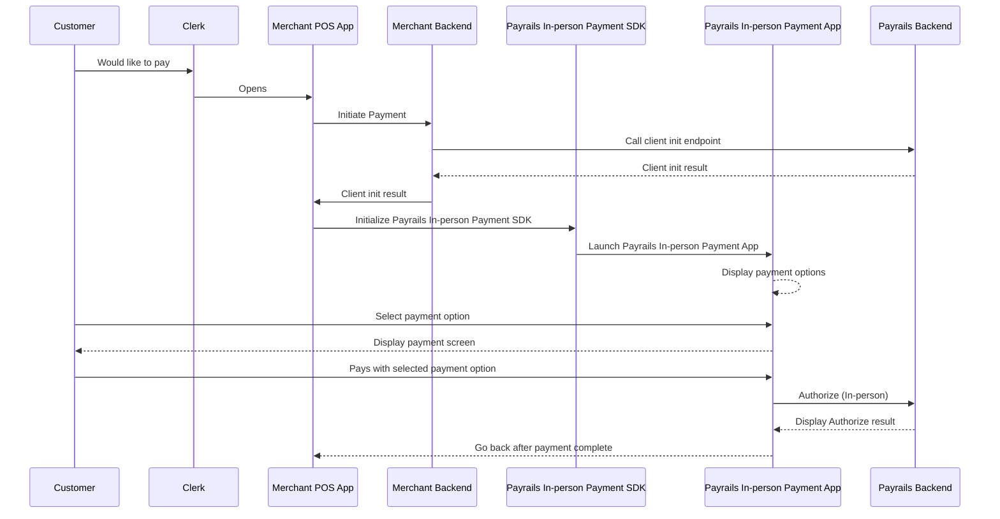

Payrails In-person allows you to turn your Android Point-of-Sale (POS) system into an acceptance device for Visa & Mastercard contactless cards, contactless wallets including Apple Pay & Google Pay and AliPay QR wallets.

With one single integration, you have access to the best global and local acceptance partners: Adyen (AliPay) and Stripe (Visa, Mastercard) are currently both available for preview. Your own POS app will remain outside of any certification and security scope.

> 🚧 Payrails In-person is currently in preview and we are happy to hear your feedback

# How it works

The backend of your POS software needs to integrate with the **Payrails Backend** to create the Execution and retrieve the required data to initialise the Payrails SDK in the next step.

Your Android POS App needs to integrate once with the light-weight, rarely changing **Payrails SDK.**

In addition to your Android POS App, you'll also need to install the **Payrails In-person Payment App** on each of your Android devices: It takes care of processing the In-person payments via Payrails. We frequently update it to bring to you the latest improvements and newest partners, all without requiring you to update your Android POS App every time.




# Step 1: Install the In-person Payment App

Payrails In-person Payment App is the companion App for your own POS Application. Once launched by our In-person SDK, from your own POS Application, the Payrails In-person Payment App takes care of processing the In-person payment via Payrails.

You must install the App on the same device as your POS application that is integrating the Payrails In-person SDK.

<Note>
  Contact Payrails to get access to the Payrails In-person Payment App APK to
  install on your Android device.
</Note>

- If not already done, [enable developer mode and USB debugging](https://developer.android.com/studio/debug/dev-options#enable) on your Android device
- [Install the APK](https://developer.android.com/tools/adb#move) on your device

# Step 2: Run your first test transactions

Without any coding, you can immediately familiarise yourself with Payrails In-person by running some test transactions with the In-person Test App. Later in Step 3, you'll learn how to integrate Payrails In-person with your own POS App.

## 2.1 Install the In-person Test App

Payrails provides a simple test application that already integrates the In-person Payment SDK and can be installed on your Android device alongside the Payrails In-person Payment App.

<Note>
  Contact Payrails to get access to the Payrails In-person Test App APK to
  install on your Android device.
</Note>

- If not already done, [enable developer mode and USB debugging](https://developer.android.com/studio/debug/dev-options#enable) on your Android device
- [Install the APK](https://developer.android.com/tools/adb#move) on your device

## 2.2 Create an execution via the Payrails Portal

In the portal, navigate to _Workflows > Test In-Person payments_ to quickly run transactions with the In-person Test App and - later - test your integration with the Payrails In-person Payment SDK and App. The page allows you to call the client init endpoint to simulate a call made by your backend. It then exposes different utilities to help you test In-person payments (copy client init response, scan QR codes, ...).

Enter e.g. 1 EUR as the amount and click Start to generate the QR codes:


You should then see two QR codes:


## 2.3 Scan the QR Codes via the Test App

Once installed, open the test application and you should see this screen:


Tap on the back arrow on the top left to open the hidden settings screen:


Click on `QR code 1` and `QR code 2` to scan the respective QR codes displayed in the Test In-person payments page on the portal.

> 📘 Why scan the QR codes to initialize the In-person Test app?
>
> The Test In-persons payments page calls the client init call and exposes the details via QR code to make it easy to setup the Test app. This simulates the call to your own backend that should call the client init endpoint on Payrails backend.

Once scanned, go back to the main screen and click on the button to accept the offer and trigger a In-person payments via Payrails In-person SDK and App.

## 2.4 Run a Card payment

To test card payments, select `Card` payment option.

- If you run our debug Payment App APK, the card payment is simulated and will succeed by default. This allows to test card payments without the need of a physical test card.
- If you run our release Payment App APK, you will need a physical test card to be able to test the card payments. Reach out to us if you don't have a test card yet.


## 2.5 Run an Alipay QR Code payment

The Test In-person Payments page also generates a new Alipay QR Code that you can scan with the In-person Payment App to test Alipay QR code In-person payments.


Select `Alipay (QR Code)` payment option and scan the QR code


You should get an approved transaction after a couple of seconds.

# Step 3: Integrate Payrails In-person with your own POS

Now that you know how everything will look like for your store staff and shoppers, it's time to integrate Payrails In-person with your own POS app.

## 3.1 Integrate the In-person SDK

### Include the SDK

You can fetch the [SDK from Maven Central](https://central.sonatype.com/artifact/com.payrails.android/inperson) by including the following dependency:

```kotlin build.gradle.kts
implementation("com.payrails.android:inperson:0.6.0")
```

```Text build.gradle
implementation "com.payrails.android:inperson:0.6.0"
```

If the dependency cannot be resolved, make sure that Maven Central is part of your repositories:

```Text build.gradle.kts or build.gradle
mavenCentral()
```

### Initialize the SDK

Use the `init()` method to initialize a Payrails client as shown below.

```kotlin Kotlin
val config = PayrailsInPersonSDK.Configuration(
	data = <data>, // Data from the response of the client init call
)
val payrailsClient = Payrails.init(config)
```

```Text Java
import com.payrails.android.inperson.sdk.*;

// ...

String version = "<version>"; // Version from the response of the client init call
String data = "<data>"; // Data from the response

PayrailsInPersonSDK.Configuration.InitData initData
                = new PayrailsInPersonSDK.Configuration.InitData(version, data);
PayrailsInPersonSDK.Configuration config
                = new PayrailsInPersonSDK.Configuration(initData,null);

PayrailsInPersonSDK payrailsClient = PayrailsInPersonSDK.Companion.init(config);
```

For a proper production deployment, your backend needs to call the [Initialize a client SDK](in-person#33-create-the-initialisation-data-via-your-backend--receive-webhooks) endpoint to define amount, currency and further transaction-related settings. You simply have to forward the response to SDK via your POS App.

To quickly start running test transactions without having to change your backend yet, [you can also generate the required init data via the Payrails Portal](in-person#32-create-the-initialisation-data-via-the-portal-testing-only).

### Launch the Payrails Payment App

#### From current context

Launches Payrails In-person payment app from the current context.

```kotlin Kotlin
payrailsClient.launchPaymentApp(this)
```

```java Java
payrailsClient.launchPaymentApp(this, null);
```

#### With authorization result handler (recommended)

It is recommended to define a handler to retrieve the result of the authorization and handle potential errors inside your own POS application.

The Payrails' In-person Payment App returns 2 results:

- `AUTHORIZE_RESPONSE`: When the authorization was successful or when the authorization failed with some business error.
- `ERROR`: When the authorization failed, even in case of some technical error.

```kotlin Kotlin
import com.payrails.android.inperson.sdk.AuthorizeResponse
import com.payrails.android.inperson.sdk.ActivityOutput.RESULT

//...

// Declare the handler in your activity
val authorizeHandler =
        registerForActivityResult(ActivityResultContracts.StartActivityForResult()) { result ->
            val response = result.data?.getParcelableExtra(RESULT, AuthorizeResponse::class.java)
            if (response != null && response.isSuccess()) {
                // Logic when payment is successful (ex: display payment success screen)
            } else {
                // Handle payment failed / error
                val errorMessage = response?.errorMessage
                Log.e("PayrailsInPersonSDK", "Payment failed: $errorMessage")
            }
        }
// ...
// Launch Payrails' In-person Payment App with a registered handler
payrailsClient.launchPaymentApp(activityLauncher = authorizeLauncher)
```

```java Java
import com.payrails.android.inperson.sdk.AuthorizeResponse
import com.payrails.android.inperson.sdk.ActivityOutput

//...

ActivityResultContracts.StartActivityForResult contract = new ActivityResultContracts.StartActivityForResult();

// Declare the handler in your activity to handle approved and failed payments
ActivityResultCallback<ActivityResult> authorizeHandler =
  new ActivityResultCallback<ActivityResult>() {
            @Override
            public void onActivityResult(ActivityResult result) {
                AuthorizeResponse response = null;
                if(result.getData() != null) {
                    if (Build.VERSION.SDK_INT >= Build.VERSION_CODES.TIRAMISU) {
                        response = result.getData().getParcelableExtra(ActivityOutput.RESULT, AuthorizeResponse.class);
                    }
                }

                if (response != null && response.isSuccess()) {
                    Log.i("PayrailsInPersonSDK:", "success");

                  	// Logic when payment is successful (ex: display payment success screen)

                } else {
                    String errorMessage = "";
                    if(response != null) {
                        errorMessage = response.getErrorMessage();
                    }

                    Log.i("PayrailsInPersonSDK:", "Payment failed: " + errorMessage);
                    // Handle payment failed / error
                }
            }
        };


// ...
// Launch Payrails' In-Person Payment App with a registered handler
ActivityResultLauncher<Intent> authorizeLauncher = registerForActivityResult(contract, authorizeHandler);
payrailsClient.launchPaymentApp(this, authorizeLauncher);

```

This requires a new dependency to [Androidx Activity](https://developer.android.com/jetpack/androidx/releases/activity):

```Text Kotlin
androidx.activity:activity-ktx:<version>
```

```java Java
androidx.activity:activity:<version>
```

You'll also need to make sure to include the SDK classes in your `proguard-rules.pro`:

```groovy proguard-rules.pro
# Keep the SDK's Parcelable and classes
-keep class com.payrails.android.inperson.** { *; }

-keep class com.payrails.android.inperson.sdk.AuthorizeResponse implements android.os.Parcelable { *; }
-keepclassmembers class * implements android.os.Parcelable {
    static ** CREATOR;
}
```

## 3.2 Create the initialisation data via the Portal (Testing only)

The Test In-person payments page allows you to quickly copy the response from the client init call and directly test the SDK initialization.

For this, click on `Copy Client Init Response` to get the response json in your clipboard


You can then use that json to initialize the SDK with a few lines of code only

```kotlin Kotlin
// This example uses kotlinx serialization - replace with your json serialization library
val json = Json.new()
// Client init response copied from the portal
val clientInitResponse = """{"version":"1.0.0","data":"eyJhbGciOiJSUzI..."}"""
val clientInitData = json.decodeFromString<InitData>(clientInitResponse) PayrailsInPersonSDK.init(Configuration(initData = clientInitData))
```

```Text Java
import org.json.JSONException;
import org.json.JSONObject;

// ...

String clientInitResponse = "{\"version\":\"1.0.0\",\"data\":\"\"}";

JSONObject payload = null;
String version = null;
String data = null;
try {
    payload = new JSONObject(clientInitResponse);
    version = payload.getString("version");
    data = payload.getString("data");
} catch (JSONException e) {
    // Handle exception
}


PayrailsInPersonSDK.Configuration.InitData initData
                = new PayrailsInPersonSDK.Configuration.InitData(version, data);
PayrailsInPersonSDK.Configuration config
                = new PayrailsInPersonSDK.Configuration(initData,null);

PayrailsInPersonSDK payrailsClient = PayrailsInPersonSDK.Companion.init(config);
```

Make sure to always replace _clientInitResponse_ with the latest response you generated via the Portal, i.e. copy and paste the response into Android Studio and re-run the app.

## 3.3 Create the initialisation data via your Backend & receive Webhooks

For production, the backend of your POS software needs to [integrate with the **Payrails Backend**](/reference/clientinit), with your [API credentials](/docs/set-up-your-payrails-account-and-environment/api-credentials) and [MTLS certificate](getting-started), to automatically create the Execution and retrieve the required data to initialise the Payrails SDK by calling the [Initialize client SDK endpoint](/reference/clientinit).

```Text JSON
{
    "type": "dropIn",
    "holderReference": "customer-001",
    "workflowCode": "payment-acceptance",
    "workflowConfigVersion": "154884",
    "merchantReference": "order-001",
    "meta": {
        "order": {
            "processingType": "InPerson"
        },
        "vendor": {
            "device": {
                "reference": "android-device-000"
            },
            "location": {
                "reference": "location-XYZ"
            }
        }
    },
    "amount": {
        "value": "42.42",
        "currency": "EUR"
    }
}
```

By providing a `merchantReference`, you can query the status of the execution/payment later on.

Your **Webhook server** also receives notifications that inform you about the outcome of each payment, [just like for online payments via Payrails](payment-acceptance/receive-notifications).

## 3.4 Extend your receipt to include required payment data

In order to comply with card scheme and wallet requirements, you will need to add additional information related to the payment to your receipt.

> 🚧 Payrails In-person is currently in preview. Come back soon for code samples for receipts

## Optional: Implement refunds

> 🚧 Payrails In-person is currently in preview. Come back soon for code samples for refunds
