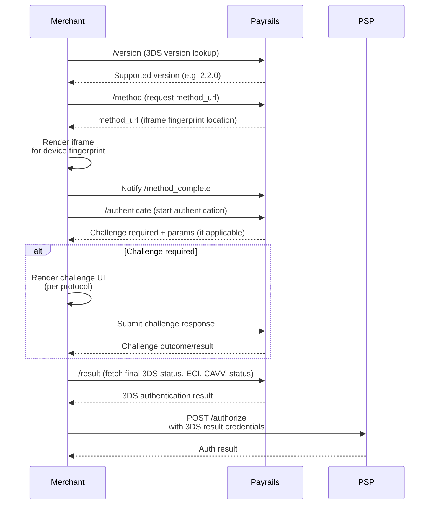
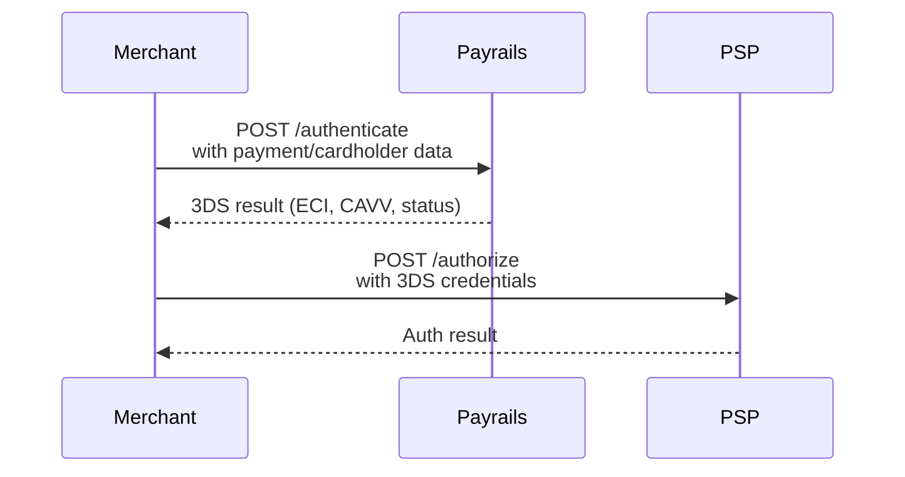
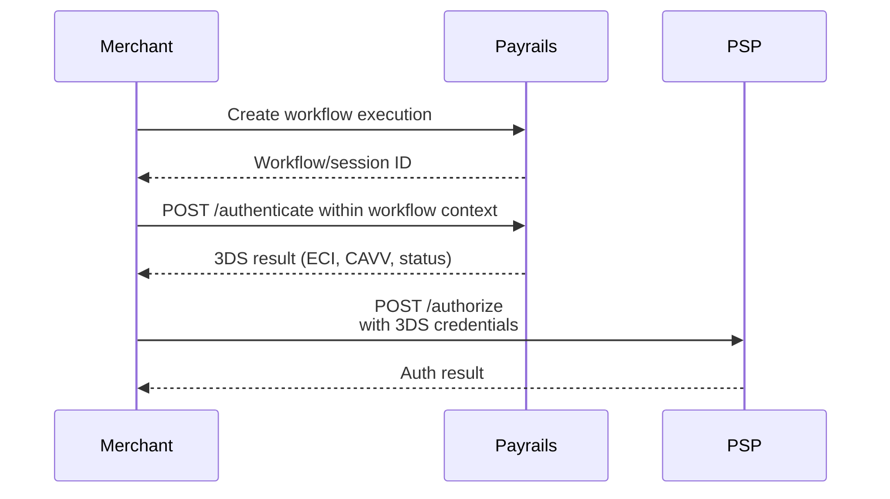
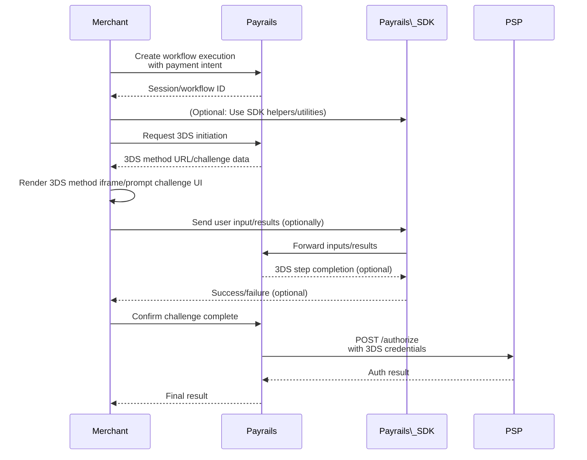
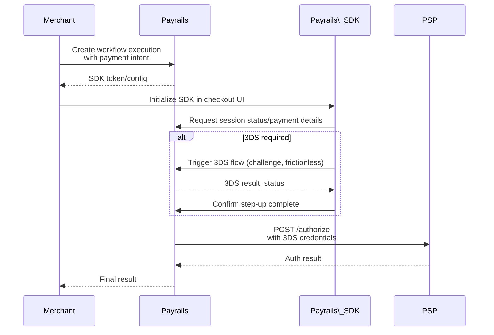

## Overview

_Standalone 3DS_ empowers businesses to perform EMV 3D Secure (3DS) authentication independently of the payment authorization process, with any PSP of choice. This decoupling maximizes flexibility for custom checkout flows, multi-PSP scenarios, and optimized fraud/conversion strategies.

---

## Key Benefits

- **API Ownership:** End-to-end programmatic 3DS control, from initiation through result handling.
- **Unbundled Authentication:** Perform authentication separately from authorization, supporting tailored routing and orchestration.
- **Enhanced Insights:** Per-transaction data visibility on issuer and challenge outcomes.
- **Wide Card & Geo Support:** All major schemes and all Payrails-supported regions (with exceptions; see docs).
- **Customizable Flows:** Align authentication logic to your fraud, conversion, and cost requirements.

---

## Usage Patterns

Choose from five supported integration patterns depending on your degree of orchestration, UI, and workflow complexity:

### 1. Fine-Grained API Orchestration (Full Control)

Full lifecycle management—separate version negotiation, method, fingerprinting, challenge orchestration, and 3DS result fetch.

Best for: Merchants requiring the deepest integration or maximum observability/control over the entire 3DS lifecycle.

## 2. One-Shot API (Direct Authentication)

All steps collapsed into a single authentication API call—fastest implementation, less orchestration.

Best for: Simple integrations prioritizing speed over granular control.

## 3. Workflow Session-based Pattern (Custom Business Logic)

Decouple authentication from session/workflow creation; allows tracking and controlling business process state.

Best for: Complex business flows needing correlation across sessions, auditability, or staged checkouts.

## 4. Hybrid Flow with Payrails SDK (Merchant-Driven)

Mix direct API calls with optional SDK utilities/helpers for portions like challenge rendering or device fingerprinting.

Best for: Merchants wanting flexible use of SDKs for complex UI, but control over business logic in backend/services.

## Full Checkout SDK Flow (Low-code)

End-to-end journey via SDK—SDK manages session, payment detail collection, challenge UX, and result forwarding.

Best for: Fastest go-live, minimal custom code, fully managed UX.

 

3DS Authentication Integration Flow\
For most use cases, refer to the usage pattern above that matches your integration model. For maximum control and transparency, use the Fine-Grained API Orchestration flow.

 

flowchart LR\
INITIATE\[Initiate 3DS Authentication] --> AUTH_RESULT\[Receive 3DS Result]
AUTH_RESULT --|Success|--> PROCEED\[Proceed to Payment Auth]
AUTH_RESULT --|Failure|--> RETRY\[Handle Retry or Fail]
Integration Steps:

 

Create a 3DS Authentication Object\
Provide transaction amount, currency, and context (e.g., payment or non-payment).
Reuse an existing Payment Method or supply card data per PCI compliance.
(Optional) Add Acquirer Details
Pass custom acquirer or directory server data as required for specific PSPs or schemes.
Set Flow Preferences
Choose challenge types (e.g., frictionless) via flow_preference.
Submit for Authentication
Finalize by submitting required browser/device data.
Handle Results
On success, use cryptogram for authorization with any PSP.
On failure, manage retries or failure flows per your policy.
Example Requests
Create Payment Authentication

 

curl https\://api.payrails.com/v1/three_d_secure/authentications \ &#x20;
-u "\<\<YOUR_SECRET_KEY>>:" \\
-H "Payrails-Version: 2025-07-30;" \\
-d message_category=payment_authentication \\
-d amount=1000 \\
-d currency=EUR
Non-Payment Authentication

 

curl https\://api.payrails.com/v1/three_d_secure/authentications \ &#x20;
-u "\<\<YOUR_SECRET_KEY>>:" \\
-H "Payrails-Version: 2025-07-30;" \\
-d message_category=non_payment_authentication \\
-d amount=0 \\
-d currency=EUR
Pass Acquirer Details

 

curl https\://api.payrails.com/v1/three_d_secure/authentications \ &#x20;
-u "\<\<YOUR_SECRET_KEY>>:" \\
-H "Payrails-Version: 2025-07-30;" \\
-d directory_server=visa \\
-d "acquirer_details\[acquirer_bin]"=424242 \\
-d "acquirer_details\[merchant_id]"=050661454304761 \\
-d "acquirer_details\[country]"=IE
Set Frictionless Flow

 

curl https\://api.payrails.com/v1/three_d_secure/authentications \ &#x20;
-u "\<\<YOUR_SECRET_KEY>>:" \\
-H "Payrails-Version: 2025-07-30;" \\
-d "flow_preference\[type]"=frictionless
Submit for Device Fingerprinting

 

curl https\://api.payrails.com/v1/three_d_secure/authentications/\{\{AUTHENTICATION_ID}}/submit \ &#x20;
-u "\<\<YOUR_SECRET_KEY>>:" \\
-H "Payrails-Version: 2025-07-30;" \\
\--data-urlencode fingerprinting_result=\<BASE64_FINGERPRINT_DATA>
Testing & QA
For sandbox testing, use card number 4242 4242 4242 4242 for guaranteed successful authentication.
Refer to \[Testing Scenarios link] for advanced test card outcomes.
Compliance and Security References
PCI DSS: When handling raw card data, ensure adherence to PCI DSS requirements. For more, see \[Payrails PCI Compliance guide] (#).
Data Privacy: Ensure all device/browser data is handled per applicable data protection laws.
Frequently Asked Questions
Q: What if my PSP requires a specific 3DS data format?
A: See "Passing Acquirer Details and Directory Server" for custom routing.

 

Q: Can I retry after a failed authentication?\
A: Yes, orchestrate retries via your business logic and the 3DS object lifecycle.

 

Q: Is the solution scheme-agnostic?\
A: Yes, supports all major schemes and regional schemes where supported by Payrails.
