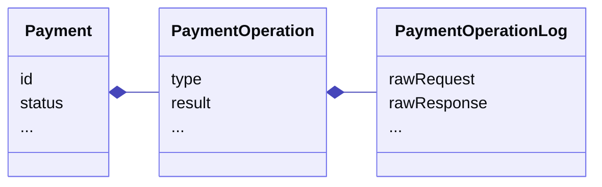
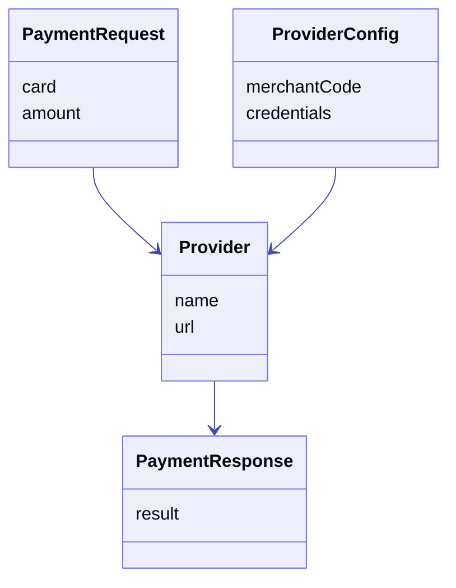
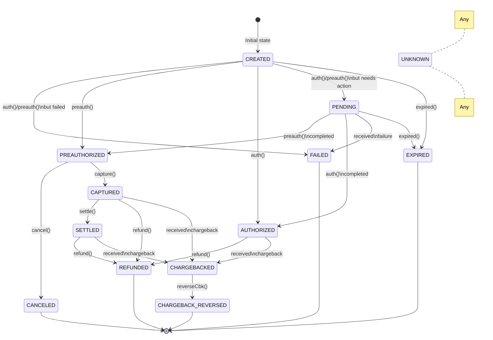

A Payment in Payrails is **an operation that involves money movements from or to outside the scope of Payrails**. This could involve card payments, an external wallet, a bank transfer, any alternative payment methods (APM), etc.

There could be many operations involved in a Payment, and each of them has their possible previous and next operations. This means that some operations only make sense if another one happened previously. Also, each operation comes with different types of errors and responses.

This is why the best way to describe a Payment is as a collection of operations over time, where the latest operation may define the current status of the Payment. In case this last operation failed for any reason, the status of the payment should not be altered (unless the failure leaves the payment in another status, which in this case should be indicated accordingly).

In terms of storage, this approach involves having the following tables:

- `payment` = holds the identifier, the most important fields (TBD), and the current status
- `payment_operation` = an ordered collection of all the operations that led to the current status (including human interventions and notifications from external providers)
- `payment_operation_log` = the complete and raw information for each of those operations, usually involving request and response JSONs for external calls

This structure allows us to have:

- a fast understanding of where the payment is right now (by querying the `payment` table)
- the complete history of how we arrived to that state (by the `payment_operation` rows related to a `payment`)
- durable and auditable logs of what exactly came in and out of our system (in `payment_operation_log` table for each `payment_operation`)

This proposed structure is inspired on the [Event Sourcing](https://microservices.io/patterns/data/event-sourcing.html) and [CQRS](https://microservices.io/patterns/data/cqrs.html) microservices patterns. However, because each of the events in the history of a Payment usually involves an interaction with a third-party external service, we cannot leverage all the features proposed by the Event Sourcing pattern, e.g. the ability to recreate a Payment by replaying the events in the queue.

## PaymentProviders

Communication with external providers to execute any of the operations should follow the data flow described in this diagram:

The logic for interacting with an external provider should be as much encapsulated as possible, leaving the process as:

- receive a generic `PaymentRequest` object
- validate if the object contains all the requirements for the specific provider
- translate the object to the required parameters for the specific provider
- load merchant specific configuration (merchantId, credentials, etc.) for calling the provider
- execute the operation (managing all the communication details, e.g. timeouts, authentication, signature, etc.)
- interpret the response received to go from provider specific codes to our own generic codes
- respond with a generic `PaymentResponse` object

## OperationType

There are many possible OperationTypes in our system and even more to come.

The first group are the **basic financial operations** for payments:

| Type         | Description                                                                                               |
| :----------- | :-------------------------------------------------------------------------------------------------------- |
| AUTHORIZE    | One-step payment authorization process containing final authorization and capture.                        |
| PREAUTHORIZE | Authorize request for a Two-step payment authorization process. Also known as reserve/hold.               |
| CAPTURE      | Capture request of a Two-step payment payment authorization process.                                      |
| VOID         | Void request of a payment in preauthorized status.                                                        |
| REFUND       | Refund request of a Captured payment. Can be full or partial.                                             |
| CANCEL       | Void or Refund request depending on the status of the payment (Pre-authorized or Captured or Authorized). |
| CREDIT       | Move money outside of our system, e.g. payouts, external transfers.                                       |

The next group is related to **notification to and from providers**.

| Type                | Description                                                           |
| :------------------ | :-------------------------------------------------------------------- |
| SEND_NOTIFICATION   | Send a notification to a provider related to a payment.               |
| HANDLE_NOTIFICATION | Process notification from provider, e.g. chargeback, external refund. |

The next group, equally important, is for **querying external services** about payments. These operations are usually key for reconciliation processes.

| Type   | Description                                                                                   |
| :----- | :-------------------------------------------------------------------------------------------- |
| GET    | Check the status of a payment by ID in a provider.                                            |
| SEARCH | Search for payments in a provider with a specified criteria, e.g. date range, merchant, card. |

Next, we have operations related to **tokenization** of payment instruments.

| Type          | Description                                                |
| :------------ | :--------------------------------------------------------- |
| GET_TOKEN     | Get information related to a token, e.g. card public data. |
| TOKENIZE      | Create a token from the attached params.                   |
| DISABLE_TOKEN | Disable (or delete) a token in the provider's system.      |
| REGISTER      | Register an account in an external system or wallet.       |

Finally, we have operations related to 3DS and Payer Authentication processes.

| Type                    | Description                                                                                                             |
| :---------------------- | :---------------------------------------------------------------------------------------------------------------------- |
| GENERATE_3DS            | Initial call to start a standalone 3DS 1.0 process, usually generating or obtaining the necessary HTML form to display. |
| VALIDATE_3DS            | Second call to validate a previously generated 3DS process.                                                             |
| PAYER_AUTH_INIT         | Initial call to start a standalone Payer Authentication process, e.g. send device data for 3DS 2.0.                     |
| PAYER_AUTH_CHECK_ENROLL | Call for checking enrollment on authentication programs (PSD2, SCA, etc).                                               |
| PAYER_AUTH_VALIDATE     | Validate result of a Payer Authentication process.                                                                      |

## OperationResult

Each operation we execute has its own possible result, which will be the selected after mapping the status codes and content of the response from the external provider.

We should group the codes to discuss them better. Starting with the **happy path**:

| Code     | Description                                                                                                                                                                                                                                   | Retryable |
| :------- | :-------------------------------------------------------------------------------------------------------------------------------------------------------------------------------------------------------------------------------------------- | :-------- |
| SUCCESS  | Requested operation was performed successfully                                                                                                                                                                                                | -         |
| ACCEPTED | Similar to `SUCCESS` but the operation was not actually performed yet and it was scheduled for execution on the provider side. This usually is followed by waiting for a notification callback or a status querying with some waiting policy. | -         |

Next, also a type of happy path but with some type of **pending** action before they can be completed.

| Code              | Description                                                                                                                                                                                                                                                                     | Retryable |
| :---------------- | :------------------------------------------------------------------------------------------------------------------------------------------------------------------------------------------------------------------------------------------------------------------------------ | :-------- |
| PENDING           | The operation is waiting for an action to be completed. Could be the user receiving a push notification on their phone, the bank reviewing a transaction, etc.                                                                                                                  | `false`   |
| REDIRECT_REQUIRED | This is a special type of `PENDING`, where there's a redirection that needs to be made for the user to complete the process, e.g. 3DS, external wallets, etc. This result comes always with redirection data in the response body, e.g. a redirect URL and a set of parameters. | `false`   |

Let's discuss the most worrying ones next, the ones where **we don't know what actually happened**. Any of these results should be considered as a high priority to alert and analyze as soon as possible.

| Code                         | Description                                                                                                         | Retryable                               |
| :--------------------------- | :------------------------------------------------------------------------------------------------------------------ | :-------------------------------------- |
| UNKNOWN                      | Received a response, but could not be interpreted by us. Could be caused by a change in implementation on any side. | `false` (unless idempotency is ensured) |
| UNEXPECTED_PROVIDER_RESPONSE | Received a response, but it was not any of the ones that we expected for the type of operation being executed.      | `false` (unless idempotency is ensured) |
| PROVIDER_UNKNOWN_ERROR       | Same as `UNKNOWN` but from the provider's side calling another part, e.g. acquirer.                                 | `false` (unless idempotency is ensured) |

Next, equally important to analyze and optimize if possible, are the **connection and timeout** related codes.

| Code                      | Description                                                                                                                                                 | Retryable                               |
| :------------------------ | :---------------------------------------------------------------------------------------------------------------------------------------------------------- | :-------------------------------------- |
| PROVIDER_CONNECTION_ERROR | There was a problem reaching the provider services. Could be caused by an actual connection problem, or that the provider is down or not responding.        | `true`                                  |
| TIMEOUT                   | There was a timeout waiting for a response from the provider. In this case, the connection could actually be established, but there was no timely response. | `false` (unless idempotency is ensured) |
| PROVIDER_TIMEOUT          | Same as `TIMEOUT` but the connection that failed was between the provider and another actor, e.g. acquirer.                                                 | `false` (unless idempotency is ensured) |

Next, let's look at the **payment rejection** results, which depending on the provider and other factors, may go from very specific to completely generic.

| Code                  | Description                                                                                                                                                    | Retryable |
| :-------------------- | :------------------------------------------------------------------------------------------------------------------------------------------------------------- | :-------- |
| GENERIC_REJECTION     | The provider (or any of the actors in the chain) reject the transaction but do not specify a specific reason. This code is often refered to as "do not honor". | `false`   |
| FRAUD_RISK            | The transaction is rejected because there's a risk of fraud. The check could have been done by any of the players in the chain.                                | `false`   |
| DUPLICATE_OPERATION   | Payment is rejected because it would be a duplicate to another one. We should check if we were actually retrying it or it was a mistake.                       | `false`   |
| OPERATION_NOT_ALLOWED | Operation is not allowed, usually related to the current status of the transaction, e.g. trying to capture an already cancelled payment.                       | `false`   |

Next, a special type of the payment rejections, the **payment instrument rejections**.

| Code                   | Description                                                                                                                                                                            | Retryable                                    |
| :--------------------- | :------------------------------------------------------------------------------------------------------------------------------------------------------------------------------------- | :------------------------------------------- |
| INSTRUMENT_NOT_ALLOWED | Operation is not allowed for the instrument, e.g. trying to use a debit card when it should be credit.                                                                                 | `false`                                      |
| INVALID_INSTRUMENT     | The instrument is not valid for any reason not specified. In some cases the provider groups other responses into this one (insufficient balance, expired, blocked, etc.)               | `false`                                      |
| INSUFFICIENT_BALANCE   | The selected instrument doesn't have enough balance to perform the operation.                                                                                                          | `false` (needs user intervention)            |
| BLOCKED_INSTRUMENT     | Instrument is currently blocked. Could be a temporary state because it's pending an approval for example, but could be permanent like when cards are blocked because they were stolen. | `false` (needs user intervention to unblock) |
| EXPIRED_INSTRUMENT     | Instrument is expired. In case it was a card, it reached the expiration date. In case it was a token, it may have been revoked or was initially issued for a short time.               | `false`                                      |

Next, we have the **parameter or configuration** errors. These could be similar to the rejections, but could be caused by a problem with formatting, missing required parameters, etc.

| Code                  | Description                                                                                                                                                                                      | Retryable |
| :-------------------- | :----------------------------------------------------------------------------------------------------------------------------------------------------------------------------------------------- | :-------- |
| VALIDATION_ERROR      | Before sending the transaction to the provider, we performed a parameter validation and it failed. This code comes together with a list of errors specifying the fields and problems.            | `false`   |
| PARAMS_ERROR          | After sending the transction to the provider, they decided not to execute it becuase of a problem with the parameters we sent. Could be a required field is missing, incorrectly formatted, etc. | `false`   |
| PROVIDER_CONFIG_ERROR | When sending the transaction to the provider, they refused to process it because we are missing something required for the operation, e.g. merchant ID, client secret, etc.                      | `false`   |
| INVALID_SIGNATURE     | For providers that require a signature in the requests, there's a specific result for when the signature was actually invalid.                                                                   | `false`   |

Last but not least, if something went very wrong during the operation and there was actually an internal server error, we need to indicate it. And, of course, fix it as soon as possible!

| Code                  | Description                                                                                               | Retryable                               |
| :-------------------- | :-------------------------------------------------------------------------------------------------------- | :-------------------------------------- |
| INTERNAL_SERVER_ERROR | There was an error in our system while trying to process the operation. This should be fixed immediately. | `false` (unless idempotency is ensured) |

## PaymentStatus

Once an operation of a specific type (OperationType) was executed and we interpreted its result (OperationResult), we are ready to change the status of the actual payment.

In case the operation we executed on the payment wasn't successful, the status of the payment shouldn't be changed except for a newly created payment, if authorization failed, we should change the status to Failed.

However, if the result of the operation is `UNKNOWN`, we must change the status of the payment to `UNKNOWN` and act fast to solve the situation so that we are able to either move the payment back to the previous status or to the new one.

| Code                | Description                                                                                                                                                                                                                        |
| :------------------ | :--------------------------------------------------------------------------------------------------------------------------------------------------------------------------------------------------------------------------------- |
| CREATED             | Initial state. Payment is created but not yet executed.                                                                                                                                                                            |
| PENDING             | An action is pending, either on the user, the provider, or us.                                                                                                                                                                     |
| UNKNOWN             | There was a problem that left the payment in an unknown state. This situation should be resolved as soon as possible.                                                                                                              |
| FAILED              | Payment failed because of a reason specified in another field.                                                                                                                                                                     |
| EXPIRED             | Payment was waiting for an action for too long. Time should be configured per merchant.                                                                                                                                            |
| PREAUTHORIZED       | Two-step payment was preauthorized successfully in the provider.                                                                                                                                                                   |
| AUTHORIZED          | One-step payment was preauthorized successfully in the provider.                                                                                                                                                                   |
| CANCELLED           | Two-step payment was cancelled (or voided) successfully in the provider.                                                                                                                                                           |
| CAPTURED            | Two-step payment was captured successfully in the provider.                                                                                                                                                                        |
| SETTLED             | Whenever a provider informed us that the payment is settled. Not all providers have a notification for this, so this status may be skipped.                                                                                        |
| REFUNDED            | Payment (one or two-step) was successfully refunded in the provider. This status is only present if there was a full refund. For partial refunds, the status remains as it was before but refunds are found in the operation list. |
| CHARGEBACKED        | Payment was chargebacked by user.                                                                                                                                                                                                  |
| CHARGEBACK_REVERSED | Payment was chargebacked, but we managed to reverse it after a dispute.                                                                                                                                                            |

## Disclaimer

**There may be a `RECONCILED` status in the future, but discussions are pending on how to implement this as many of the already defined status in the list can be reconciled against the bank reconciliation file.**
