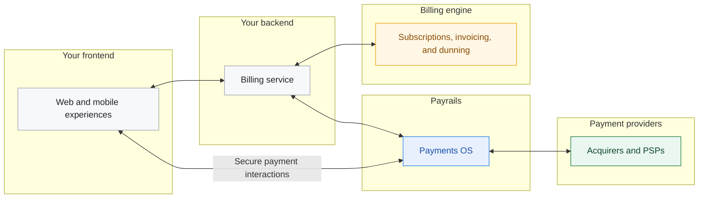

This guide shows how to pair a billing engine with Payrails for sign-up, renewals, retries, and instrument management.

## Supported billing engines

Payrails works with any billing engine that:

- Creates invoices for subscription charges
- Sends invoice lifecycle webhooks (for example, “invoice ready to pay”)
- Exposes an API to record external payments against invoices

Examples include an in-house billing engine or third-party systems such as Stripe, Chargebee, Metronome, Recurly, Lago, and others.



## User journeys

<Tabs>
  <Tab title="Sign-up and first payment">

**End-user experience:**

- Pay with a preferred payment method, whether card or local payment method

**Recommended approach:**

1. Your billing engine creates a customer and subscription and generates an invoice.
2. Payrails Drop-in or Elements collects and stores a payment instrument.
3. Your backend records the successful payment in your billing engine and links the stored instrument for future renewals.


  </Tab>

  <Tab title="Manage payment instruments">

**End-user experience:**

- Update payment methods, manage subscriptions, and view previous invoices in a branded portal

**Recommended approach:**

1. Own the customer portal UX.
2. Payrails Drop-in or Elements collects and updates payment instruments.
3. Retrieve payment history via `Payrails` APIs and invoice history from billing engine APIs.

  </Tab>

  <Tab title="Renewals and MITs">

**End-user experience:**

- Renewals run on saved credentials with correct flags for COF/MIT and SCA as needed

**Recommended approach:**

1. Your billing engine generates a renewal invoice and notifies your backend.
2. Your backend instructs Payrails to charge a stored instrument.
3. Payrails runs orchestration for the attempt.
   

  </Tab>

  <Tab title="Dunning and recovery">

**End-user experience:**

- Receive clear communication of upcoming renewals
- In the event of failure, receive a link to update payment methods

**Recommended approach:**

1. If your engine supports webhook-driven retries, listen to the events and instruct Payrails to charge a stored instrument and report attempt outcomes.
2. If not, schedule retries in your backend to instruct Payrails to charge a stored instrument.

**Ownership note:**

1. Payrails performs payment orchestration upon receiving a request to retry a payment.
2. Either the engine or your system owns dunning emails and cadence of retries.
3. The `Payrails` PSP retry cascading happens per payment attempt: one billing engine attempt triggers one Payrails execution with multiple attempts across providers.

<Accordion title="Engine supports webhook retries" icon="fa-info-circle">


</Accordion>

<Accordion title="Engine does not support webhook retries" icon="fa-info-circle">


</Accordion>
  </Tab>
</Tabs>

## Integration details

This guide uses a fictional subscription business called Needle & Groove. The examples are in TypeScript, but the API calls apply in any language.

### Understand the identifiers

Align these identifiers across your frontend, backend, Payrails, and billing engine:

- `holderReference`: Your customer identifier. Make sure your billing engine contains a reference from the customer object to this identifier.
- `invoiceId`: The invoice you need to pay (created by your billing engine).
- `paymentInstrumentId`: The stored Payrails instrument to charge for renewals.
- `paymentId`: The `Payrails` payment transaction identifier for an attempt. Store it against the invoice to reconcile billing-engine invoice attempts with Payrails outcomes.
- `merchantReference`: A unique identifier for the payment attempt. A common choice is `invoiceId` plus the attempt number.

In Payrails, represent amounts in major units strings (for example, `25.00` for €25.00) and use ISO 4217 currencies.

### Set up server-side `Payrails` access

Make Payrails API calls from your server and keep credentials off the client.

Use these Payrails docs to set up authentication and mutual TLS:

- [API credentials](/docs/set-up-your-payrails-account-and-environment/api-credentials)
- [mTLS configuration](/docs/orchestration/getting-started)

The server endpoints in this guide follow this recommended pattern:

- `POST /api/payrails/init` calls `Payrails` `POST /merchant/client/init` using mTLS + OAuth.
- `POST /api/payrails/execution` calls `Payrails` `POST /merchant/workflows/{workflowCode}/executions`.
- `GET /api/payrails/instruments?holderReference=...` lists instruments for a customer.

### Accept the first subscription payment

This guide creates the invoice in your billing engine first. Then initializes Payrails with the invoice amount and collect a payment method. Authorize the payment first and only create the invoice once you are sure a payment has been successful to not have unused subscriptions.

1. **Create a subscription and invoice in your billing engine**

Return at least these fields to your frontend:

- `invoiceId`
- `amount`
- `currency`

Example request to your billing engine adapter:

```ts TypeScript
type CreateSubscriptionRequest = {
  email: string;
  amountMinor: number;
  currency: string;
  holderReference: string;
  interval: "month" | "year" | "...";
};

type CreateSubscriptionResponse = {
  invoiceId?: string;
  amount: string;
  currency: string;
  holderReference: string;
  customer?: { id: string };
  subscription?: { id: string };
};

export async function createSubscriptionAndInvoice(baseUrl: string) {
  const body: CreateSubscriptionRequest = {
    email: "johndoe@example.com",
    amount: 25.0,
    currency: "EUR",
    holderId: "b8fe6271-5d71-4d28-b8e8-89e64acc0c49",
    interval: "month",
  };

  const res = await fetch(`/api/subscriptions`, {
    method: "POST",
    headers: { "Content-Type": "application/json" },
    body: JSON.stringify(body),
  });

  if (!res.ok) throw new Error(await res.text());
  return (await res.json()) as CreateSubscriptionResponse;
}
```

```py Python
from typing import TypedDict, Optional
import requests


class CreateSubscriptionResponse(TypedDict, total=False):
    invoiceId: str
    amount: str
    currency: str
    holderReference: str
    customer: dict
    subscription: dict


def create_subscription_and_invoice(base_url: str) -> CreateSubscriptionResponse:
    body = {
        "email": "johndoe@example.com",
        "amount": 25.00,
        "currency": "EUR",
        "holderId": "b8fe6271-5d71-4d28-b8e8-89e64acc0c49",
        "interval": "month",
    }

    res = requests.post(f"/api/subscriptions", json=body)
    res.raise_for_status()
    return res.json()
```

```java Java
import java.net.URI;
import java.net.http.HttpClient;
import java.net.http.HttpRequest;
import java.net.http.HttpResponse;

public class BillingEngineExample {
  public static String createSubscriptionAndInvoice(String baseUrl) throws Exception {
    String json = "{" +
      "\"email\":\"johndoe@example.com\"," +
      "\"amount\":25.00," +
      "\"currency\":\"EUR\"," +
      "\"holderId\":\"b8fe6271-5d71-4d28-b8e8-89e64acc0c49\"," +
      "\"interval\":\"month\"" +
    "}";

    HttpClient client = HttpClient.newHttpClient();
    HttpRequest req = HttpRequest.newBuilder()
      .uri(URI.create("/api/subscriptions"))
      .header("Content-Type", "application/json")
      .POST(HttpRequest.BodyPublishers.ofString(json))
      .build();

    HttpResponse<String> res = client.send(req, HttpResponse.BodyHandlers.ofString());
    if (res.statusCode() < 200 || res.statusCode() >= 300) {
      throw new RuntimeException(res.body());
    }
    return res.body();
  }
}
```

2. **Initialize the Payrails Web SDK (server-side)**

Call your backend to create a Payrails client session.

```ts TypeScript
type PayrailsAmount = {
  value: string;
  currency: string;
}

type PayrailsInitRequest = {
  amount: PayrailsAmount;
  type: string;
  workflowCode: string;
  merchantReference: string;
  holderReference: string;
  meta?: Record<string, unknown>;
}

export async function initPayrailsSession(baseUrl: string) {
  const body: PayrailsInitRequest = {
    amount: { value: String(amount), currency: 'EUR' },
    type: 'dropIn',
    workflowCode: 'payment-acceptance',
    merchantReference: 'invoiceId',
    holderReference: 'tp_2bc33192-7de7-41ba-b01d-f84bc8cc4f8a'
    meta: { order: { reference: invoiceId } }
  }

  const res = await fetch(`/api/payrails/init`, {
    method: 'POST',
    headers: {
        Authorization: `Bearer ${accessToken}`,
        'Content-Type': 'application/json',
        'Accept': 'application/json',
        'x-idempotency-key': crypto.randomUUID(),
    },
    body: JSON.stringify(body),
  })

  if (!res.ok) throw new Error(await res.text())
  return await res.json()
}
```

```py Python
import uuid
import requests


def init_payrails_session(base_url: str, access_token: str, invoice_id: str, amount: int) -> dict:
    body = {
        "amount": {"value": str(amount), "currency": "EUR"},
        "type": "dropIn",
        "workflowCode": "payment-acceptance",
        "merchantReference": invoice_id,
        "holderReference": "tp_2bc33192-7de7-41ba-b01d-f84bc8cc4f8a",
        "meta": {"order": {"reference": invoice_id}},
    }
    headers = {
        "Authorization": f"Bearer {access_token}",
        "Content-Type": "application/json",
        "Accept": "application/json",
        "x-idempotency-key": str(uuid.uuid4()),
    }

    res = requests.post(f"/api/payrails/init", json=body, headers=headers)
    res.raise_for_status()
    return res.json()
```

```java Java
import java.net.URI;
import java.net.http.HttpClient;
import java.net.http.HttpRequest;
import java.net.http.HttpResponse;
import java.util.UUID;

public class PayrailsInitExample {
  public static String initPayrailsSession(String baseUrl, String accessToken, String invoiceId, int amountMinor) throws Exception {
    String json = "{" +
      "\"amount\":{\"value\":\"" + amountMinor + "\",\"currency\":\"EUR\"}," +
      "\"type\":\"dropIn\"," +
      "\"workflowCode\":\"payment-acceptance\"," +
      "\"merchantReference\":\"" + invoiceId + "\"," +
      "\"holderReference\":\"tp_2bc33192-7de7-41ba-b01d-f84bc8cc4f8a\"," +
      "\"meta\":{\"order\":{\"reference\":\"" + invoiceId + "\"}}" +
    "}";

    HttpRequest req = HttpRequest.newBuilder()
      .uri(URI.create("/api/payrails/init"))
      .header("Authorization", "Bearer " + accessToken)
      .header("Content-Type", "application/json")
      .header("Accept", "application/json")
      .header("x-idempotency-key", UUID.randomUUID().toString())
      .POST(HttpRequest.BodyPublishers.ofString(json))
      .build();

    HttpClient client = HttpClient.newHttpClient();
    HttpResponse<String> res = client.send(req, HttpResponse.BodyHandlers.ofString());
    if (res.statusCode() < 200 || res.statusCode() >= 300) throw new RuntimeException(res.body());
    return res.body();
  }
}
```

3. **Mount Drop-in or Elements (client-side)**

Use the Payrails init response to mount payment UI:

- Read the [Payrails Web SDK overview](/docs/orchestration/checkout-sdks/index)
- Use [Drop-in](/docs/orchestration/checkout-sdks/web/drop-in) for a pre-built payment UI:
- Use [Elements](/docs/orchestration/checkout-sdks/web/elements) for individual UI building blocks

Your `onSuccess` handler triggers the backend to do two things:

- Resolve the stored `paymentInstrumentId` and attach it to the billing provider `customer`
- Record the successful payment against the invoice in your billing engine

> **Note:** Achieve the same result by using webhooks with `Payrails` and waiting for a successful payment. Ensure all information required by the handler is included as `meta` for that execution.

### Record the payment in your billing engine

After Payrails authorization succeeds, record the external payment against your invoice. Some billing engines support this logic for failed payments as well.

At minimum, your billing engine update typically:

- Marks the invoice as paid (or records a successful attempt)
- Associates a “default payment method” reference with the customer for renewals
- Stores the Payrails `paymentInstrumentId` and `holderReference` to charge it off-session

#### Example: Record a successful payment (adapter shape)

Use a backend endpoint that takes your invoice fields plus the Payrails instrument reference.

This page shows adapter-shaped examples. In your integration, implement these endpoints in your own backend:

- `POST /api/stripe/record-payment` (creates a payment method with metadata and records a payment)
- `POST /api/chargebee/record-payment` (offline collection example shape)

Example request body:

```ts TypeScript
type RecordPaymentRequest = {
  invoiceId: string;
  customerId: string;
  subscriptionId?: string;
  instrumentId: string;
  amount: number;
  currency: string;
  successAt: string;
};

export async function recordPaidInvoice(baseUrl: string) {
  const body: RecordPaymentRequest = {
    invoiceId: "inv_123",
    customerId: "cus_123",
    subscriptionId: "sub_123",
    instrumentId: "55028ccb-ab15-42f4-9174-a98913b942ac",
    amount: 25.0,
    currency: "EUR",
    successAt: new Date().toISOString(),
  };

  // In your integration, replace this with your billing engine adapter endpoint.
  const res = await fetch(`/api/billing_engine/record-payment`, {
    method: "POST",
    headers: { "Content-Type": "application/json" },
    body: JSON.stringify(body),
  });

  if (!res.ok) throw new Error(await res.text());
  return await res.json();
}
```

```py Python
import requests
from datetime import datetime, timezone


def record_paid_invoice(base_url: str) -> dict:
    body = {
        "invoiceId": "inv_123",
        "customerId": "cus_123",
        "subscriptionId": "sub_123",
        "instrumentId": "55028ccb-ab15-42f4-9174-a98913b942ac",
        "amount": 2500,
        "currency": "EUR",
        "successAt": datetime.now(timezone.utc).isoformat(),
    }

    res = requests.post(f"/api/billing_engine/record-payment", json=body)
    res.raise_for_status()
    return res.json()
```

```java Java
import java.net.URI;
import java.net.http.HttpClient;
import java.net.http.HttpRequest;
import java.net.http.HttpResponse;
import java.time.Instant;

public class RecordPaymentExample {
  public static String recordPaidInvoice(String baseUrl) throws Exception {
    String json = "{" +
      "\"invoiceId\":\"inv_123\"," +
      "\"customerId\":\"cus_123\"," +
      "\"subscriptionId\":\"sub_123\"," +
      "\"instrumentId\":\"55028ccb-ab15-42f4-9174-a98913b942ac\"," +
      "\"amount\":2500," +
      "\"currency\":\"EUR\"," +
      "\"successAt\":\"" + Instant.now().toString() + "\"" +
    "}";

    HttpRequest req = HttpRequest.newBuilder()
      .uri(URI.create("/api/billing_engine/record-payment"))
      .header("Content-Type", "application/json")
      .POST(HttpRequest.BodyPublishers.ofString(json))
      .build();

    HttpClient client = HttpClient.newHttpClient();
    HttpResponse<String> res = client.send(req, HttpResponse.BodyHandlers.ofString());
    if (res.statusCode() < 200 || res.statusCode() >= 300) throw new RuntimeException(res.body());
    return res.body();
  }
}
```

If you use a different billing engine, keep the same intent:

- Store `instrumentId` on the customer (or payment method)
- Record the invoice payment using your billing engine’s external payments API

### Run renewals and off-session attempts

For renewals, your billing engine typically emits a webhook when an invoice is ready to be paid.

Your backend then:

1. Loads invoice details (amount, currency, `holderReference`, `paymentInstrumentId`)
2. Calls Payrails to execute an off-session payment attempt
3. Records the attempt result back into the billing engine

#### Example: Billing engine webhook handler

Your billing-engine webhook handler typically:

- Verifies webhook signatures
- Retrieves the invoice and associated details
- Calls `POST /api/payrails/execution`
- Reports the outcome back into the billing engine

Adapt the same pattern to your billing engine’s webhook format and security model.

#### Create a workflow execution (server-side)

Expose a server endpoint that creates a Payrails workflow execution (a thin wrapper around Payrails `POST /merchant/workflows/{workflowCode}/executions`).

To learn more about creating executions, read the [Payrails Create a workflow execution](/docs/orchestration/payment-acceptance/create-a-workflow-execution) overview.

```ts TypeScript
type PayrailsExecutionRequest = {
  amount: number;
  currency: string;
  invoiceId?: string;
  holderReference?: string;
  paymentInstrumentId?: string;
  merchantReference?: string;
};

export async function createPayrailsExecution(baseUrl: string) {
  const body: PayrailsExecutionRequest = {
    amount: 25.0,
    currency: "EUR",
    invoiceId: "inv_123",
    holderReference: "tp_123e4567-e89b-12d3-a456-426614174000",
    paymentInstrumentId: "55028ccb-ab15-42f4-9174-a98913b942ac",
    merchantReference: "inv_123",
  };

  const res = await fetch(`/api/payrails/execution`, {
    method: "POST",
    headers: { "Content-Type": "application/json" },
    body: JSON.stringify(body),
  });

  if (!res.ok) throw new Error(await res.text());
  return await res.json();
}
```

```py Python
import requests


def create_payrails_execution(base_url: str) -> dict:
    body = {
        "amount": 25.00,
        "currency": "EUR",
        "invoiceId": "inv_123",
        "holderReference": "tp_123e4567-e89b-12d3-a456-426614174000",
        "paymentInstrumentId": "55028ccb-ab15-42f4-9174-a98913b942ac",
        "merchantReference": "inv_123",
    }
    res = requests.post(f"/api/payrails/execution", json=body)
    res.raise_for_status()
    return res.json()
```

```java Java
import java.net.URI;
import java.net.http.HttpClient;
import java.net.http.HttpRequest;
import java.net.http.HttpResponse;

public class PayrailsExecutionExample {
  public static String createPayrailsExecution(String baseUrl) throws Exception {
    String json = "{" +
      "\"amount\":25.00," +
      "\"currency\":\"EUR\"," +
      "\"invoiceId\":\"inv_123\"," +
      "\"holderReference\":\"tp_123e4567-e89b-12d3-a456-426614174000\"," +
      "\"paymentInstrumentId\":\"55028ccb-ab15-42f4-9174-a98913b942ac\"," +
      "\"merchantReference\":\"inv_123\"" +
    "}";

    HttpRequest req = HttpRequest.newBuilder()
      .uri(URI.create("/api/payrails/execution"))
      .header("Content-Type", "application/json")
      .POST(HttpRequest.BodyPublishers.ofString(json))
      .build();

    HttpClient client = HttpClient.newHttpClient();
    HttpResponse<String> res = client.send(req, HttpResponse.BodyHandlers.ofString());
    if (res.statusCode() < 200 || res.statusCode() >= 300) throw new RuntimeException(res.body());
    return res.body();
  }
}
```

### Implement retries and dunning

Define who owns the retry schedule:

- If your billing engine schedules retries, record each attempt result and wait for the next webhook.
- If your billing engine does not schedule retries, schedule attempts in your backend (job queue or cron).

Keep the mapping simple:

- One billing-engine attempt triggers one Payrails workflow execution
- One Payrails execution can include multiple cascaded provider attempts (managed by Payrails)

### Manage instruments

Use Payrails as your source of truth for instruments.

1. **List instruments for a customer:**

```ts TypeScript
async function listInstruments() {
  const url = new URL("/api/payrails/instruments");
  url.searchParams.set(
    "holderReference",
    "tp_123e4567-e89b-12d3-a456-426614174000",
  );

  const res = await fetch(url.toString(), { method: "GET" });
  if (!res.ok) throw new Error(await res.text());

  const data = (await res.json()) as { instruments: Array<{ id: string }> };
  return data.instruments;
}
```

```py Python
import requests


def list_instruments(base_url: str) -> list[dict]:
    res = requests.get(
        f"/api/payrails/instruments",
        params={"holderReference": "tp_123e4567-e89b-12d3-a456-426614174000"},
    )
    res.raise_for_status()
    return res.json()["instruments"]
```

```java Java
import java.net.URI;
import java.net.URLEncoder;
import java.net.http.HttpClient;
import java.net.http.HttpRequest;
import java.net.http.HttpResponse;
import java.nio.charset.StandardCharsets;

public class ListInstrumentsExample {
  public static String listInstruments(String baseUrl) throws Exception {
    String holder = "tp_123e4567-e89b-12d3-a456-426614174000";
    String url = "/api/payrails/instruments?holderReference=" + URLEncoder.encode(holder, StandardCharsets.UTF_8);

    HttpRequest req = HttpRequest.newBuilder()
      .uri(URI.create(url))
      .GET()
      .build();

    HttpClient client = HttpClient.newHttpClient();
    HttpResponse<String> res = client.send(req, HttpResponse.BodyHandlers.ofString());
    if (res.statusCode() < 200 || res.statusCode() >= 300) throw new RuntimeException(res.body());
    return res.body();
  }
}
```

2. **Delete an instrument:**

```ts TypeScript
export async function deletePayrailsInstrument(
  baseUrl: string,
  instrumentId: string,
) {
  const res = await fetch(
    `/api/payrails/instruments/${encodeURIComponent(instrumentId)}`,
    { method: "DELETE" },
  );
  if (!res.ok) throw new Error(await res.text());
  return await res.json();
}
```

```py Python
import requests


def delete_payrails_instrument(base_url: str, instrument_id: str) -> dict:
    res = requests.delete(f"/api/payrails/instruments/{instrument_id}")
    res.raise_for_status()
    return res.json()
```

```java Java
import java.net.URI;
import java.net.http.HttpClient;
import java.net.http.HttpRequest;
import java.net.http.HttpResponse;

public class DeleteInstrumentExample {
  public static String deletePayrailsInstrument(String baseUrl, String instrumentId) throws Exception {
    HttpRequest req = HttpRequest.newBuilder()
      .uri(URI.create("/api/payrails/instruments/" + instrumentId))
      .DELETE()
      .build();

    HttpClient client = HttpClient.newHttpClient();
    HttpResponse<String> res = client.send(req, HttpResponse.BodyHandlers.ofString());
    if (res.statusCode() < 200 || res.statusCode() >= 300) throw new RuntimeException(res.body());
    return res.body();
  }
}
```

If your customer portal allows changing the default payment method, update your billing engine’s default reference and keep the Payrails instrument link on the billing-engine side.

## Implementation checklist

- [ ] **Decide billing integration model:** 3rd party billing engine or in‑house. Confirm event model and available webhooks
- [ ] **Pilot scope and KPIs:** Select one or two markets, define first‑payment vs renewal KPIs, baseline metrics, and success thresholds
- [ ] **Provisioning and security:** Create Payrails workspace, set up mTLS credentials, create default test workflow, connect first PSP in sandbox
- [ ] **Webhooks and events:** Configure invoice and payment events from the engine (e.g., invoice.created, invoice.finalized, payment_intent.succeeded/failed) and Payrails outcome webhooks
- [ ] **Signup and first payment flow:** Integrate Payrails Elements/Drop‑in for tokenization, associate instrument to customer in billing engine, call charge API, handle callbacks
- [ ] **Renewals (MIT) setup:** Store instrument IDs, set correct COF/MIT flags, implement renewal charge path from engine invoice notifications
- [ ] **Customer portal flow:** Update instrument IDs, see payment history, generate payment links
- [ ] **Dunning ownership:** Define email cadence and retry schedule. Wire Payrails attempt outcomes to engine or backend retry logic
- [ ] **Routing configuration:** Start with market‑based routing, enable failover and smart retries. Add BIN, brand, and method rules as needed
- [ ] **Payment methods and geography:** Enable required APMs and local acquiring per pilot markets; verify SCA and exemptions policy
- [ ] **Reporting and reconciliation:** Build unified payments view. Map Payrails events to ERP/finance systems for settlement and invoice matching
- [ ] **Go‑live checklist:** Production credentials, webhook signatures verified, idempotency keys, error handling and retries tested, monitoring and alerts configured
