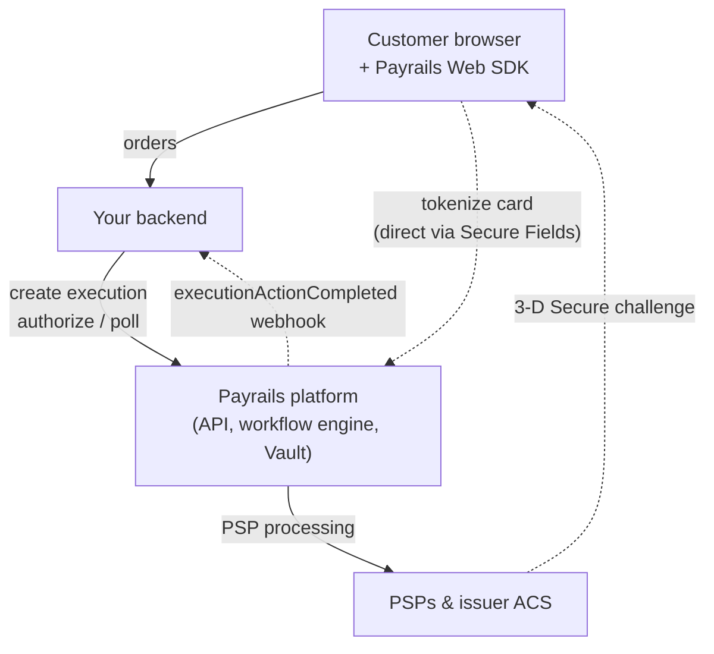
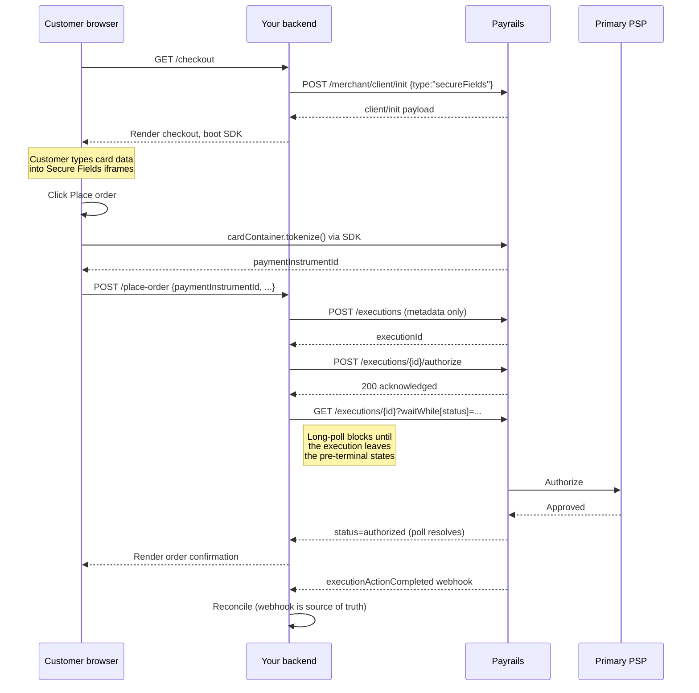
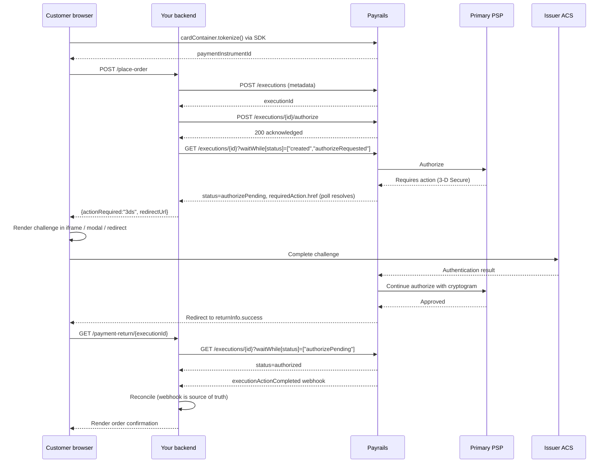

The server-to-server architecture is the Payrails integration pattern where your backend owns the payment lifecycle. Your backend creates [executions](/docs/resources/executions), calls authorize against them, handles [3-D Secure](/docs/orchestration/payment-acceptance/3d-secure) redirects, and reconciles state from [webhooks](/docs/orchestration/receive-notifications). The Payrails Web SDK appears only as a thin layer on the frontend, hosting [Secure Fields](/docs/orchestration/secure-fields) — the iframes that tokenize card data before the data reaches your servers.

This page documents the architecture end to end. It covers the components, the two sequence flows (frictionless and 3-D Secure), and the canonical frontend and backend code for each step.

<Note>
  If your frontend can host the [Drop-in
  SDK](/docs/orchestration/checkout-sdks/web-v5-legacy/drop-in) — the SDK that
  drives the full payment lifecycle from the client — choose that pattern
  instead. Use the Drop-in SDK when your frontend owns the customer session and
  Payrails should drive the full payment lifecycle. Use the server-to-server
  pattern when your backend owns order creation, fraud checks, and customer
  messaging, or when your tech stack cannot host a single-page application.
</Note>

## When to choose this pattern

Choose the server-to-server architecture when one or more of the following holds:

- You use an e-commerce engine that relies on a synchronous auth decision. Magento, Salesforce Commerce Cloud.
- You require control over the decision making on when to do the authorization based on backend decisions, e.g. running fraud checks, inventory checks etc. Payrails fits into that flow rather than taking ownership of it.
- You need explicit control over the 3-D Secure challenge UX, such as iframe or modal rendering on your existing checkout page.

## Architecture

This diagram shows the systems involved and the direction of data flow between them. The customer browser hosts only the Payrails Web SDK for tokenization; every other call from the browser routes through your backend.



Read the diagram in two passes. The three solid arrows trace the main request path. The customer places an order against your backend. Your backend creates the execution and authorizes it against Payrails. Payrails routes the authorization through one or more Payment Service Providers (PSPs).

The three dashed arrows are the exceptions to that path. The browser tokenizes card data directly with Payrails through the [Vault](/docs/overview/vault) so the PAN never reaches your servers. The PSP routes a 3-D Secure challenge to the customer's browser when the issuer requires one. Payrails sends an `executionActionCompleted` webhook to your backend once the authorization resolves.

The Payrails platform handles four jobs in this architecture: card tokenization through the Vault, workflow orchestration including the PSP cascade, 3-D Secure handoff, and webhook delivery. The PSP cascade is the workflow-configured chain of providers Payrails retries the authorize against on a decline. Your backend orchestrates everything else.

## Frictionless authorization flow

A frictionless authorization completes without a 3-D Secure challenge. The customer never touches a Payrails-hosted URL. This sequence diagram shows the full path from card entry to order confirmation.



## 3-D Secure authorization flow

The authorize call itself returns an acknowledgment. Your backend learns that a challenge is required via the `executionActionPending` webhook or by long-polling `GET /executions/{id}`. When the execution moves to status `authorizePending`, the state carries `actionRequired: "3ds"` and a `requiredAction` object whose `href` is the hosted challenge URL. Your backend returns the URL to the storefront, which renders the challenge in your preferred container — iframe, modal, new tab, or full-page redirect. Payrails returns the customer to your `returnInfo.success` URL once the challenge resolves.



If the primary PSP declines after the challenge resolves, Payrails passes the cryptogram to the next PSP in the cascade. The challenge runs once per transaction, not once per PSP.

## Frontend implementation

The frontend mounts a Payrails Web SDK element, collects a payment method, and hands a `paymentInstrumentId` to your backend. The element handles every PCI-scoped field. The PAN, the CVV, and the BIN never reach your servers. Render the 3-D Secure container separately; the same container is shared across every element.

Five elements support this server-to-server pattern. All five end the frontend flow with a `paymentInstrumentId` your backend passes to `POST /executions/{id}/authorize`:

- **Secure Fields** — three separate iframes (number, expiry, CVV) for full layout control.
- **Card Form Element** — a pre-composed card form. Faster to integrate, single mount point.
- **Card List Element** — renders the customer's saved cards for repeat purchases.
- **Apple Pay Element** — the Apple Pay button for wallet checkout on Safari and iOS.
- **Google Pay Element** — the Google Pay button for wallet checkout.

The `client/init.type` setting controls which elements the SDK exposes. Use `"secureFields"` for Secure Fields or Card Form. Use `"tokenization"` for Card List and the wallet buttons. Do not use `"dropIn"` for this pattern — that mode lets the SDK drive authorize and bypasses your backend.

### Post to your backend

Every element ends the same way: hand the `paymentInstrumentId` and `paymentMethodCode` to your backend. This shared helper is referenced by every tab in the next section:

```js
async function postToBackend({ paymentInstrumentId, paymentMethodCode }) {
  const response = await fetch("/checkout/place-order", {
    method: "POST",
    headers: { "Content-Type": "application/json" },
    body: JSON.stringify({
      paymentInstrumentId,
      paymentMethodCode,
      amount: { value: "129.90", currency: "EUR" },
      orderReference: window.currentOrderReference,
    }),
  }).then((r) => r.json());

  if (response.actionRequired === "3ds" && response.redirectUrl) {
    openThreeDsChallenge(response.redirectUrl);
    return;
  }
  if (response.status === "authorized") {
    window.location.assign(`/order-confirmation/${response.orderReference}`);
    return;
  }
  renderError(response);
}
```

The shared boot sequence is identical across elements: fetch `client/init`, call `Payrails.init`, then mount the chosen element. The SDK returns a `SaveInstrumentResponse` from direct tokenize calls (Secure Fields, Card Form) and a `StoredPaymentInstrument` from the Card List `onCardChange` callback. The `id` field on either is the value to pass as `paymentInstrumentId`.

### Mount and tokenize

<Tabs>
  <Tab title="Secure Fields">
    Mount three iframes (one per PCI-scoped field), call `cardContainer.tokenize()` on form submission, and hand the resulting `id` to your backend.

    ```html
    <form id="checkout-form">
      <label for="card-number">Card number</label>
      <div id="card-number"></div>

      <label for="card-expiry">Expiry</label>
      <div id="card-expiry"></div>

      <label for="card-cvv">CVV</label>
      <div id="card-cvv"></div>

      <button id="place-order" type="button">Place order</button>
    </form>
    ```

    ```js
    const initOptions = await fetch('/payments/init', { method: 'POST' })
      .then(r => r.json())
    const payrails = Payrails.init(initOptions)

    const cardContainer = payrails.collectContainer({ containerType: 'COLLECT' })
    cardContainer.createCollectElement({ type: 'CARD_NUMBER' }).mount('#card-number')
    cardContainer.createCollectElement({ type: 'EXPIRATION_DATE' }).mount('#card-expiry')
    cardContainer.createCollectElement({ type: 'CVV' }).mount('#card-cvv')

    document.getElementById('place-order').addEventListener('click', async () => {
      const tokenized = await cardContainer.tokenize({ storeInstrument: false })
      await postToBackend({
        paymentInstrumentId: tokenized.id,
        paymentMethodCode:   'card',
      })
    })
    ```

    `storeInstrument: false` keeps the instrument ephemeral. Pass `true` when the customer has opted in to saving the card on the profile. Requires `client/init.type: "secureFields"`.

  </Tab>

  <Tab title="Card Form">
    The pre-composed card form mounts as a single element and exposes its own `tokenize()` and `validate()` methods.

    ```html
    <form id="checkout-form">
      <div id="card-form"></div>
      <button id="place-order" type="button">Place order</button>
    </form>
    ```

    ```js
    const initOptions = await fetch('/payments/init', { method: 'POST' })
      .then(r => r.json())
    const payrails = Payrails.init(initOptions)

    const cardForm = payrails.cardForm()
    cardForm.mount('#card-form')

    document.getElementById('place-order').addEventListener('click', async () => {
      const validation = await cardForm.validate()
      if (!validation.isValid) {
        renderError(validation.fieldErrors)
        return
      }
      const tokenized = await cardForm.tokenize({ storeInstrument: false })
      await postToBackend({
        paymentInstrumentId: tokenized.id,
        paymentMethodCode:   'card',
      })
    })
    ```

    `cardForm.validate()` returns `{ isValid, error?, fieldErrors? }` and lets you render per-field errors before the tokenize call. Requires `client/init.type: "secureFields"`.

  </Tab>

  <Tab title="Card List">
    The saved-cards list renders the customer's stored instruments and emits `onCardChange` when the customer selects one. No tokenization step runs; the card is already vaulted.

    ```html
    <div id="saved-cards"></div>
    <button id="pay-with-saved" type="button" disabled>Pay with saved card</button>
    ```

    ```js
    const initOptions = await fetch('/payments/init', { method: 'POST' })
      .then(r => r.json())
    const payrails = Payrails.init(initOptions)

    let selectedCardId = null
    const payButton = document.getElementById('pay-with-saved')

    const cardList = payrails.cardList({
      onCardChange: (card) => {
        selectedCardId = card.id
        payButton.disabled = false
      },
    })
    cardList.mount('#saved-cards')

    payButton.addEventListener('click', async () => {
      if (!selectedCardId) return
      await postToBackend({
        paymentInstrumentId: selectedCardId,
        paymentMethodCode:   'card',
      })
    })
    ```

    `payrails.getSavedCreditCards()` returns the same set of instruments synchronously if you need to render them yourself instead of using the element. Requires `client/init.type: "tokenization"`.

  </Tab>

  <Tab title="Apple Pay">
    Mount the Apple Pay button unconditionally. The SDK checks availability internally and renders nothing on devices that cannot pay with Apple Pay. The merchant intercepts `onSuccess('TOKENIZE', event)` to obtain the `paymentInstrumentId`.

    ```html
    <div id="apple-pay-button"></div>
    ```

    ```js
    const initOptions = await fetch('/payments/init', { method: 'POST' })
      .then(r => r.json())
    const payrails = Payrails.init(initOptions)

    const applePayButton = payrails.applePayButton({
      clientDomain: 'yourdomain.example',
      styles:       { type: 'buy', style: 'black' },
      events: {
        onSuccess: async (action, event) => {
          if (action !== 'TOKENIZE') return
          await postToBackend({
            paymentInstrumentId: event.id,
            paymentMethodCode:   'applePay',
          })
        },
        onFailed: (action, event) => renderError(event),
      },
    })
    applePayButton.mount('#apple-pay-button')
    ```

    `clientDomain` must match the Apple Pay merchant configuration registered with Apple. The button styles follow Apple's design guidelines; `styles.type` and `styles.style` together pick the variant. Requires `client/init.type: "tokenization"`.

  </Tab>

  <Tab title="Google Pay">
    Mount the Google Pay button unconditionally. The merchant intercepts `onSuccess('TOKENIZE', event)` to obtain the `paymentInstrumentId`, just like Apple Pay.

    ```html
    <div id="google-pay-button"></div>
    ```

    ```js
    const initOptions = await fetch('/payments/init', { method: 'POST' })
      .then(r => r.json())
    const payrails = Payrails.init(initOptions)

    const googlePayButton = payrails.googlePayButton({
      merchantInfo: {
        merchantId:   'YOUR_GOOGLE_PAY_MERCHANT_ID',
        merchantName: 'Your store',
      },
      styles: { buttonColor: 'BLACK', buttonType: 'PAY' },
      events: {
        onSuccess: async (action, event) => {
          if (action !== 'TOKENIZE') return
          await postToBackend({
            paymentInstrumentId: event.id,
            paymentMethodCode:   'googlePay',
          })
        },
        onFailed: (action, event) => renderError(event),
      },
    })
    googlePayButton.mount('#google-pay-button')
    ```

    `merchantInfo.merchantId` comes from your Google Pay business console. Button styles follow Google's design guidelines; `styles.buttonColor` and `styles.buttonType` together pick the variant. Requires `client/init.type: "tokenization"`.

  </Tab>
</Tabs>

### Render the 3-D Secure container

The 3-D Secure container is the same across every element. When the `postToBackend` response carries `actionRequired: "3ds"` and a `redirectUrl`, render the URL in your chosen container — iframe, modal, new tab, or full-page redirect. The customer completes the challenge. Payrails returns them to your `returnInfo.success` URL. The return page posts back to the opener so the checkout page can route to the confirmation step.

```html
<div id="threeds-modal" hidden>
  <iframe id="threeds-iframe" title="3-D Secure challenge"></iframe>
</div>
```

```js
function openThreeDsChallenge(redirectUrl) {
  const iframe = document.getElementById("threeds-iframe");
  iframe.src = redirectUrl;
  document.getElementById("threeds-modal").hidden = false;
}

// The Payrails return page posts back to the opener once your backend
// has re-read the execution status.
window.addEventListener("message", (event) => {
  if (event.origin !== window.location.origin) return;
  if (event.data?.type !== "threeds:complete") return;
  window.location.assign(`/order-confirmation/${event.data.orderReference}`);
});
```

## Backend implementation

The backend authenticates with Payrails, creates the execution, calls authorize against the tokenized `paymentInstrumentId`, and returns a clean two-case contract to the storefront. This code uses Python and the `requests` library; the same shape applies to any HTTP client.

### Authentication

The Payrails OAuth token endpoint returns a token valid for one hour. Cache the token in memory and refresh on expiry.

<Tabs>
  <Tab title="Python">
    ```python
    import os
    import requests

    PAYRAILS_HOST = os.environ['PAYRAILS_HOST']
    PAYRAILS_CLIENT_ID = os.environ['PAYRAILS_CLIENT_ID']
    PAYRAILS_CLIENT_SECRET = os.environ['PAYRAILS_CLIENT_SECRET']


    def get_access_token() -> str:
        """Return a fresh Payrails OAuth token."""
        response = requests.post(
            f'https://{PAYRAILS_HOST}/auth/token/{PAYRAILS_CLIENT_ID}',
            headers={'x-api-key': PAYRAILS_CLIENT_SECRET},
            timeout=10,
        )
        response.raise_for_status()
        return response.json()['access_token']
    ```

  </Tab>

  <Tab title="Java">
    ```java
    import java.net.URI;
    import java.net.http.HttpClient;
    import java.net.http.HttpRequest;
    import java.net.http.HttpResponse;
    import java.time.Duration;
    import org.json.JSONObject;

    public class PayrailsClient {
        static final String HOST          = System.getenv("PAYRAILS_HOST");
        static final String CLIENT_ID     = System.getenv("PAYRAILS_CLIENT_ID");
        static final String CLIENT_SECRET = System.getenv("PAYRAILS_CLIENT_SECRET");

        private static final HttpClient HTTP = HttpClient.newBuilder()
            .connectTimeout(Duration.ofSeconds(10))
            .build();

        public static String getAccessToken() throws Exception {
            HttpRequest req = HttpRequest.newBuilder()
                .uri(URI.create("https://" + HOST + "/auth/token/" + CLIENT_ID))
                .header("x-api-key", CLIENT_SECRET)
                .timeout(Duration.ofSeconds(10))
                .POST(HttpRequest.BodyPublishers.noBody())
                .build();
            HttpResponse<String> resp = HTTP.send(req, HttpResponse.BodyHandlers.ofString());
            if (resp.statusCode() >= 300) {
                throw new RuntimeException("Auth failed: " + resp.body());
            }
            return new JSONObject(resp.body()).getString("access_token");
        }
    }
    ```

  </Tab>

  <Tab title="TypeScript">
    ```ts
    const HOST          = process.env.PAYRAILS_HOST!
    const CLIENT_ID     = process.env.PAYRAILS_CLIENT_ID!
    const CLIENT_SECRET = process.env.PAYRAILS_CLIENT_SECRET!

    export async function getAccessToken (): Promise<string> {
      const response = await fetch(
        `https://${HOST}/auth/token/${CLIENT_ID}`,
        {
          method:  'POST',
          headers: { 'x-api-key': CLIENT_SECRET },
        },
      )
      if (!response.ok) {
        throw new Error(`Auth failed: ${await response.text()}`)
      }
      const body = await response.json() as { access_token: string }
      return body.access_token
    }
    ```

  </Tab>

  <Tab title="C#">
    ```csharp
    using System.Net.Http;
    using System.Net.Http.Json;
    using System.Text.Json.Serialization;

    public partial class PayrailsClient
    {
        private static readonly string Host         = Environment.GetEnvironmentVariable("PAYRAILS_HOST")!;
        private static readonly string ClientId     = Environment.GetEnvironmentVariable("PAYRAILS_CLIENT_ID")!;
        private static readonly string ClientSecret = Environment.GetEnvironmentVariable("PAYRAILS_CLIENT_SECRET")!;
        private static readonly HttpClient Http     = new() { Timeout = TimeSpan.FromSeconds(10) };

        public async Task<string> GetAccessTokenAsync()
        {
            using var request = new HttpRequestMessage(
                HttpMethod.Post,
                $"https://{Host}/auth/token/{ClientId}");
            request.Headers.Add("x-api-key", ClientSecret);

            using var response = await Http.SendAsync(request);
            response.EnsureSuccessStatusCode();
            var body = await response.Content.ReadFromJsonAsync<TokenResponse>();
            return body!.AccessToken;
        }

        private record TokenResponse(
            [property: JsonPropertyName("access_token")] string AccessToken);
    }
    ```

  </Tab>

  <Tab title="Go">
    ```go
    package payrails

    import (
        "encoding/json"
        "fmt"
        "net/http"
        "os"
        "time"
    )

    var (
        Host         = os.Getenv("PAYRAILS_HOST")
        ClientID     = os.Getenv("PAYRAILS_CLIENT_ID")
        ClientSecret = os.Getenv("PAYRAILS_CLIENT_SECRET")
        httpClient   = &http.Client{Timeout: 10 * time.Second}
    )

    func GetAccessToken() (string, error) {
        url := fmt.Sprintf("https://%s/auth/token/%s", Host, ClientID)
        req, err := http.NewRequest(http.MethodPost, url, nil)
        if err != nil {
            return "", err
        }
        req.Header.Set("x-api-key", ClientSecret)

        resp, err := httpClient.Do(req)
        if err != nil {
            return "", err
        }
        defer resp.Body.Close()
        if resp.StatusCode >= 300 {
            return "", fmt.Errorf("auth failed: %d", resp.StatusCode)
        }

        var data struct {
            AccessToken string `json:"access_token"`
        }
        if err := json.NewDecoder(resp.Body).Decode(&data); err != nil {
            return "", err
        }
        return data.AccessToken, nil
    }
    ```

  </Tab>
</Tabs>

### Initialize the SDK session

This call returns the SDK configuration the frontend uses to boot. The storefront's `/payments/init` endpoint on your backend proxies the call so the OAuth token stays on the server. The body passes `workflowCode`, `holderReference`, `workspaceId`, and the `type` that matches the element your storefront is about to mount. Use `"secureFields"` for Secure Fields and Card Form. Use `"tokenization"` for Card List, Apple Pay, and Google Pay.

The response is the payload the frontend hands to `Payrails.init(...)` — return it from `/payments/init` verbatim.

<Tabs>
  <Tab title="Python">
    ```python
    def get_client_init(
        holder_reference: str,
        init_type: str,
    ) -> dict[str, Any]:
        """Fetch a client/init payload from Payrails for the storefront SDK."""
        token = get_access_token()
        response = requests.post(
            f'https://{PAYRAILS_HOST}/merchant/client/init',
            headers={
                'Authorization':     f'Bearer {token}',
                'Content-Type':      'application/json',
                'x-idempotency-key': str(uuid.uuid4()),
            },
            json={
                'workflowCode':    PAYRAILS_WORKFLOW_CODE,
                'holderReference': holder_reference,
                'workspaceId':     PAYRAILS_WORKSPACE_ID,
                'type':            init_type,
            },
            timeout=10,
        )
        response.raise_for_status()
        return response.json()
    ```
  </Tab>

  <Tab title="Java">
    ```java
    // inside class PayrailsClient
    public static JSONObject getClientInit(
        String holderReference,
        String initType
    ) throws Exception {
        String token = getAccessToken();
        JSONObject body = new JSONObject(Map.of(
            "workflowCode",    WORKFLOW_CODE,
            "holderReference", holderReference,
            "workspaceId",     WORKSPACE_ID,
            "type",            initType
        ));

        HttpRequest req = HttpRequest.newBuilder()
            .uri(URI.create("https://" + HOST + "/merchant/client/init"))
            .header("Authorization",     "Bearer " + token)
            .header("Content-Type",      "application/json")
            .header("x-idempotency-key", UUID.randomUUID().toString())
            .timeout(Duration.ofSeconds(10))
            .POST(HttpRequest.BodyPublishers.ofString(body.toString()))
            .build();

        HttpResponse<String> resp = HTTP.send(req, HttpResponse.BodyHandlers.ofString());
        if (resp.statusCode() >= 300) {
            throw new RuntimeException("Client init failed: " + resp.body());
        }
        return new JSONObject(resp.body());
    }
    ```

  </Tab>

  <Tab title="TypeScript">
    ```ts
    export type ClientInitType = 'secureFields' | 'tokenization'

    export async function getClientInit (
      holderReference: string,
      initType:        ClientInitType,
    ): Promise<Record<string, unknown>> {
      const token = await getAccessToken()
      const response = await fetch(
        `https://${HOST}/merchant/client/init`,
        {
          method:  'POST',
          headers: {
            'Authorization':     `Bearer ${token}`,
            'Content-Type':      'application/json',
            'x-idempotency-key': randomUUID(),
          },
          body: JSON.stringify({
            workflowCode:    WORKFLOW_CODE,
            holderReference,
            workspaceId:     WORKSPACE_ID,
            type:            initType,
          }),
        },
      )
      if (!response.ok) {
        throw new Error(`Client init failed: ${await response.text()}`)
      }
      return response.json()
    }
    ```

  </Tab>

  <Tab title="C#">
    ```csharp
    public partial class PayrailsClient
    {
        public async Task<JsonDocument> GetClientInitAsync(
            string holderReference,
            string initType)
        {
            var token = await GetAccessTokenAsync();
            var body = new
            {
                workflowCode = WorkflowCode,
                holderReference,
                workspaceId  = WorkspaceId,
                type         = initType,
            };

            using var request = new HttpRequestMessage(
                HttpMethod.Post,
                $"https://{Host}/merchant/client/init")
            {
                Content = JsonContent.Create(body),
            };
            request.Headers.Add("Authorization",     $"Bearer {token}");
            request.Headers.Add("x-idempotency-key", Guid.NewGuid().ToString());

            using var response = await Http.SendAsync(request);
            response.EnsureSuccessStatusCode();
            return await response.Content.ReadFromJsonAsync<JsonDocument>()
                ?? throw new InvalidOperationException("Empty client init response");
        }
    }
    ```

  </Tab>

  <Tab title="Go">
    ```go
    func GetClientInit(
        holderReference string,
        initType string,
    ) (map[string]any, error) {
        token, err := GetAccessToken()
        if err != nil {
            return nil, err
        }

        body, _ := json.Marshal(map[string]any{
            "workflowCode":    WorkflowCode,
            "holderReference": holderReference,
            "workspaceId":     WorkspaceID,
            "type":            initType,
        })

        url := fmt.Sprintf("https://%s/merchant/client/init", Host)
        req, _ := http.NewRequest(http.MethodPost, url, bytes.NewReader(body))
        req.Header.Set("Authorization",     "Bearer "+token)
        req.Header.Set("Content-Type",      "application/json")
        req.Header.Set("x-idempotency-key", uuid.NewString())

        resp, err := httpClient.Do(req)
        if err != nil {
            return nil, err
        }
        defer resp.Body.Close()
        if resp.StatusCode >= 300 {
            return nil, fmt.Errorf("client init failed: %d", resp.StatusCode)
        }

        var result map[string]any
        if err := json.NewDecoder(resp.Body).Decode(&result); err != nil {
            return nil, err
        }
        return result, nil
    }
    ```

  </Tab>
</Tabs>

### Create the execution

The first call creates the execution and locks the metadata. The body carries `merchantReference`, `holderReference`, `workspaceId`, and the `meta` block. The body does not carry `amount`, `paymentComposition`, or `initialActions` — those live on the authorize call.

<Tabs>
  <Tab title="Python">
    ```python
    import uuid
    from typing import Any

    PAYRAILS_WORKSPACE_ID = os.environ['PAYRAILS_WORKSPACE_ID']
    PAYRAILS_WORKFLOW_CODE = 'payment-acceptance'


    def create_execution(
        merchant_reference: str,
        holder_reference: str,
        meta: dict[str, Any],
    ) -> str:
        """Create a Payrails execution with metadata only. Returns the executionId."""
        token = get_access_token()
        response = requests.post(
            f'https://{PAYRAILS_HOST}/merchant/workflows'
            f'/{PAYRAILS_WORKFLOW_CODE}/executions',
            headers={
                'Authorization':     f'Bearer {token}',
                'Content-Type':      'application/json',
                'x-idempotency-key': str(uuid.uuid4()),
            },
            json={
                'merchantReference': merchant_reference,
                'holderReference':   holder_reference,
                'workspaceId':       PAYRAILS_WORKSPACE_ID,
                'meta':              meta,
            },
            timeout=10,
        )
        response.raise_for_status()
        return response.json()['id']
    ```

  </Tab>

  <Tab title="Java">
    ```java
    import java.util.Map;
    import java.util.UUID;
    import org.json.JSONObject;

    // inside class PayrailsClient
    static final String WORKSPACE_ID   = System.getenv("PAYRAILS_WORKSPACE_ID");
    static final String WORKFLOW_CODE  = "payment-acceptance";

    public static String createExecution(
        String merchantReference,
        String holderReference,
        Map<String, Object> meta
    ) throws Exception {
        String token = getAccessToken();
        JSONObject body = new JSONObject(Map.of(
            "merchantReference", merchantReference,
            "holderReference",   holderReference,
            "workspaceId",       WORKSPACE_ID,
            "meta",              meta
        ));

        HttpRequest req = HttpRequest.newBuilder()
            .uri(URI.create("https://" + HOST + "/merchant/workflows/"
                + WORKFLOW_CODE + "/executions"))
            .header("Authorization",     "Bearer " + token)
            .header("Content-Type",      "application/json")
            .header("x-idempotency-key", UUID.randomUUID().toString())
            .timeout(Duration.ofSeconds(10))
            .POST(HttpRequest.BodyPublishers.ofString(body.toString()))
            .build();

        HttpResponse<String> resp = HTTP.send(req, HttpResponse.BodyHandlers.ofString());
        if (resp.statusCode() >= 300) {
            throw new RuntimeException("Create execution failed: " + resp.body());
        }
        return new JSONObject(resp.body()).getString("id");
    }
    ```

  </Tab>

  <Tab title="TypeScript">
    ```ts
    import { randomUUID } from 'node:crypto'

    const WORKSPACE_ID   = process.env.PAYRAILS_WORKSPACE_ID!
    const WORKFLOW_CODE  = 'payment-acceptance'

    export async function createExecution (
      merchantReference: string,
      holderReference:   string,
      meta:              Record<string, unknown>,
    ): Promise<string> {
      const token = await getAccessToken()
      const response = await fetch(
        `https://${HOST}/merchant/workflows/${WORKFLOW_CODE}/executions`,
        {
          method:  'POST',
          headers: {
            'Authorization':     `Bearer ${token}`,
            'Content-Type':      'application/json',
            'x-idempotency-key': randomUUID(),
          },
          body: JSON.stringify({
            merchantReference,
            holderReference,
            workspaceId: WORKSPACE_ID,
            meta,
          }),
        },
      )
      if (!response.ok) {
        throw new Error(`Create execution failed: ${await response.text()}`)
      }
      const body = await response.json() as { id: string }
      return body.id
    }
    ```

  </Tab>

  <Tab title="C#">
    ```csharp
    using System.Net.Http.Json;

    public partial class PayrailsClient
    {
        private static readonly string WorkspaceId  = Environment.GetEnvironmentVariable("PAYRAILS_WORKSPACE_ID")!;
        private const string WorkflowCode           = "payment-acceptance";

        public async Task<string> CreateExecutionAsync(
            string merchantReference,
            string holderReference,
            Dictionary<string, object> meta)
        {
            var token = await GetAccessTokenAsync();
            var body = new
            {
                merchantReference,
                holderReference,
                workspaceId = WorkspaceId,
                meta,
            };

            using var request = new HttpRequestMessage(
                HttpMethod.Post,
                $"https://{Host}/merchant/workflows/{WorkflowCode}/executions")
            {
                Content = JsonContent.Create(body),
            };
            request.Headers.Add("Authorization",     $"Bearer {token}");
            request.Headers.Add("x-idempotency-key", Guid.NewGuid().ToString());

            using var response = await Http.SendAsync(request);
            response.EnsureSuccessStatusCode();
            var result = await response.Content.ReadFromJsonAsync<ExecutionResponse>();
            return result!.Id;
        }

        private record ExecutionResponse(string Id);
    }
    ```

  </Tab>

  <Tab title="Go">
    ```go
    import (
        "bytes"
        "github.com/google/uuid"
    )

    var (
        WorkspaceID  = os.Getenv("PAYRAILS_WORKSPACE_ID")
        WorkflowCode = "payment-acceptance"
    )

    func CreateExecution(
        merchantReference string,
        holderReference string,
        meta map[string]any,
    ) (string, error) {
        token, err := GetAccessToken()
        if err != nil {
            return "", err
        }

        body, _ := json.Marshal(map[string]any{
            "merchantReference": merchantReference,
            "holderReference":   holderReference,
            "workspaceId":       WorkspaceID,
            "meta":              meta,
        })

        url := fmt.Sprintf("https://%s/merchant/workflows/%s/executions", Host, WorkflowCode)
        req, _ := http.NewRequest(http.MethodPost, url, bytes.NewReader(body))
        req.Header.Set("Authorization",     "Bearer "+token)
        req.Header.Set("Content-Type",      "application/json")
        req.Header.Set("x-idempotency-key", uuid.NewString())

        resp, err := httpClient.Do(req)
        if err != nil {
            return "", err
        }
        defer resp.Body.Close()
        if resp.StatusCode >= 300 {
            return "", fmt.Errorf("create execution failed: %d", resp.StatusCode)
        }

        var data struct {
            ID string `json:"id"`
        }
        if err := json.NewDecoder(resp.Body).Decode(&data); err != nil {
            return "", err
        }
        return data.ID, nil
    }
    ```

  </Tab>
</Tabs>

### Authorize the execution

The second call dispatches the authorize against the tokenized `paymentInstrumentId`. The HTTP response is an acknowledgment; the actual outcome (frictionless approval, 3-D Secure required, or decline) arrives via long-poll or webhook.

<Tabs>
  <Tab title="Python">
    ```python
    def authorize_execution(
        execution_id: str,
        amount: dict[str, str],
        payment_instrument_id: str,
        payment_method_code: str,
        return_url: str,
    ) -> dict[str, Any]:
        """Dispatch the authorize. Outcome arrives via long-poll or webhook."""
        token = get_access_token()
        response = requests.post(
            f'https://{PAYRAILS_HOST}/merchant/workflows'
            f'/{PAYRAILS_WORKFLOW_CODE}/executions/{execution_id}/authorize',
            headers={
                'Authorization':     f'Bearer {token}',
                'Content-Type':      'application/json',
                'x-idempotency-key': str(uuid.uuid4()),
            },
            json={
                'amount':     amount,
                'returnInfo': {'success': return_url},
                'paymentComposition': [{
                    'paymentMethodCode':   payment_method_code,
                    'integrationType':     'api',
                    'amount':              amount,
                    'storeInstrument':     False,
                    'paymentInstrumentId': payment_instrument_id,
                }],
            },
            timeout=15,
        )
        response.raise_for_status()
        return response.json()
    ```
  </Tab>

  <Tab title="Java">
    ```java
    // inside class PayrailsClient
    public static JSONObject authorizeExecution(
        String executionId,
        Map<String, String> amount,
        String paymentInstrumentId,
        String paymentMethodCode,
        String returnUrl
    ) throws Exception {
        String token = getAccessToken();
        JSONObject paymentComposition = new JSONObject(Map.of(
            "paymentMethodCode",   paymentMethodCode,
            "integrationType",     "api",
            "amount",              amount,
            "storeInstrument",     false,
            "paymentInstrumentId", paymentInstrumentId
        ));
        JSONObject body = new JSONObject(Map.of(
            "amount",             amount,
            "returnInfo",         Map.of("success", returnUrl),
            "paymentComposition", new Object[]{ paymentComposition }
        ));

        HttpRequest req = HttpRequest.newBuilder()
            .uri(URI.create("https://" + HOST + "/merchant/workflows/" + WORKFLOW_CODE
                + "/executions/" + executionId + "/authorize"))
            .header("Authorization",     "Bearer " + token)
            .header("Content-Type",      "application/json")
            .header("x-idempotency-key", UUID.randomUUID().toString())
            .timeout(Duration.ofSeconds(15))
            .POST(HttpRequest.BodyPublishers.ofString(body.toString()))
            .build();

        HttpResponse<String> resp = HTTP.send(req, HttpResponse.BodyHandlers.ofString());
        if (resp.statusCode() >= 300) {
            throw new RuntimeException("Authorize failed: " + resp.body());
        }
        return new JSONObject(resp.body());
    }
    ```

  </Tab>

  <Tab title="TypeScript">
    ```ts
    export interface Amount { value: string; currency: string }

    export async function authorizeExecution (
      executionId:         string,
      amount:              Amount,
      paymentInstrumentId: string,
      paymentMethodCode:   string,
      returnUrl:           string,
    ): Promise<Record<string, unknown>> {
      const token = await getAccessToken()
      const response = await fetch(
        `https://${HOST}/merchant/workflows/${WORKFLOW_CODE}`
        + `/executions/${executionId}/authorize`,
        {
          method:  'POST',
          headers: {
            'Authorization':     `Bearer ${token}`,
            'Content-Type':      'application/json',
            'x-idempotency-key': randomUUID(),
          },
          body: JSON.stringify({
            amount,
            returnInfo:         { success: returnUrl },
            paymentComposition: [{
              paymentMethodCode,
              integrationType:   'api',
              amount,
              storeInstrument:   false,
              paymentInstrumentId,
            }],
          }),
        },
      )
      if (!response.ok) {
        throw new Error(`Authorize failed: ${await response.text()}`)
      }
      return response.json()
    }
    ```

  </Tab>

  <Tab title="C#">
    ```csharp
    public partial class PayrailsClient
    {
        public record Amount(string Value, string Currency);

        public async Task<JsonDocument> AuthorizeExecutionAsync(
            string executionId,
            Amount amount,
            string paymentInstrumentId,
            string paymentMethodCode,
            string returnUrl)
        {
            var token = await GetAccessTokenAsync();
            var body = new
            {
                amount,
                returnInfo         = new { success = returnUrl },
                paymentComposition = new[]
                {
                    new
                    {
                        paymentMethodCode,
                        integrationType   = "api",
                        amount,
                        storeInstrument   = false,
                        paymentInstrumentId,
                    },
                },
            };

            using var request = new HttpRequestMessage(
                HttpMethod.Post,
                $"https://{Host}/merchant/workflows/{WorkflowCode}"
                    + $"/executions/{executionId}/authorize")
            {
                Content = JsonContent.Create(body),
            };
            request.Headers.Add("Authorization",     $"Bearer {token}");
            request.Headers.Add("x-idempotency-key", Guid.NewGuid().ToString());

            using var response = await Http.SendAsync(request);
            response.EnsureSuccessStatusCode();
            return await response.Content.ReadFromJsonAsync<JsonDocument>()
                ?? throw new InvalidOperationException("Empty authorize response");
        }
    }
    ```

  </Tab>

  <Tab title="Go">
    ```go
    type Amount struct {
        Value    string `json:"value"`
        Currency string `json:"currency"`
    }

    func AuthorizeExecution(
        executionID string,
        amount Amount,
        paymentInstrumentID string,
        paymentMethodCode string,
        returnURL string,
    ) (map[string]any, error) {
        token, err := GetAccessToken()
        if err != nil {
            return nil, err
        }

        body, _ := json.Marshal(map[string]any{
            "amount":     amount,
            "returnInfo": map[string]string{"success": returnURL},
            "paymentComposition": []map[string]any{{
                "paymentMethodCode":   paymentMethodCode,
                "integrationType":     "api",
                "amount":              amount,
                "storeInstrument":     false,
                "paymentInstrumentId": paymentInstrumentID,
            }},
        })

        url := fmt.Sprintf("https://%s/merchant/workflows/%s/executions/%s/authorize",
            Host, WorkflowCode, executionID)
        req, _ := http.NewRequest(http.MethodPost, url, bytes.NewReader(body))
        req.Header.Set("Authorization",     "Bearer "+token)
        req.Header.Set("Content-Type",      "application/json")
        req.Header.Set("x-idempotency-key", uuid.NewString())

        resp, err := httpClient.Do(req)
        if err != nil {
            return nil, err
        }
        defer resp.Body.Close()
        if resp.StatusCode >= 300 {
            return nil, fmt.Errorf("authorize failed: %d", resp.StatusCode)
        }

        var result map[string]any
        if err := json.NewDecoder(resp.Body).Decode(&result); err != nil {
            return nil, err
        }
        return result, nil
    }
    ```

  </Tab>
</Tabs>

### Storefront-facing endpoint

The endpoint the storefront calls runs the two Payrails calls, long-polls for the result, and returns a clean two-case contract. On `actionRequired === "3ds"`, the storefront opens the 3-D Secure container; otherwise it renders the order confirmation page.

The authorize call returns an acknowledgment; the actual outcome (frictionless approval, 3-D Secure required, or decline) arrives via long-poll or webhook. This endpoint uses the long-poll inline so the storefront receives a single resolved response. The webhook still fires in parallel and remains the source of truth for order reconciliation; the [Webhook reconciliation](#webhook-reconciliation) section covers the handler.

<Tabs>
  <Tab title="Python">
    ```python
    def place_order(
        payment_instrument_id: str,
        payment_method_code:   str,
        amount: dict[str, str],
        order_reference: str,
        customer_reference: str,
    ) -> dict[str, Any]:
        """End-to-end place-order endpoint called by the storefront."""
        execution_id = create_execution(
            merchant_reference=order_reference,
            holder_reference=customer_reference,
            meta={
                'order':    {'reference': order_reference},
                'customer': {'reference': customer_reference},
                'tags':     {'channel': 'web'},
            },
        )

        authorize_execution(
            execution_id=execution_id,
            amount=amount,
            payment_instrument_id=payment_instrument_id,
            payment_method_code=payment_method_code,
            return_url=f'https://yourdomain.example/payment-return/{execution_id}',
        )

        result = poll_execution(
            execution_id,
            wait_while=['created', 'authorizeRequested'],
        )

        if result.get('actionRequired') == '3ds':
            return {
                'actionRequired': '3ds',
                'redirectUrl':    result['requiredAction']['href'],
                'executionId':    execution_id,
            }

        return {
            'status':         result.get('status'),
            'executionId':    execution_id,
            'orderReference': order_reference,
        }
    ```

  </Tab>

  <Tab title="Java">
    ```java
    // inside class PayrailsClient
    public static Map<String, Object> placeOrder(
        String paymentInstrumentId,
        String paymentMethodCode,
        Map<String, String> amount,
        String orderReference,
        String customerReference
    ) throws Exception {
        String executionId = createExecution(
            orderReference,
            customerReference,
            Map.of(
                "order",    Map.of("reference", orderReference),
                "customer", Map.of("reference", customerReference),
                "tags",     Map.of("channel", "web")
            )
        );

        authorizeExecution(
            executionId,
            amount,
            paymentInstrumentId,
            paymentMethodCode,
            "https://yourdomain.example/payment-return/" + executionId
        );

        JSONObject result = pollExecution(executionId, new String[]{"created", "authorizeRequested"});

        if ("3ds".equals(result.optString("actionRequired"))) {
            return Map.of(
                "actionRequired", "3ds",
                "redirectUrl",    result.getJSONObject("requiredAction").getString("href"),
                "executionId",    executionId
            );
        }

        return Map.of(
            "status",         result.optString("status"),
            "executionId",    executionId,
            "orderReference", orderReference
        );
    }
    ```

  </Tab>

  <Tab title="TypeScript">
    ```ts
    export async function placeOrder (
      paymentInstrumentId: string,
      paymentMethodCode:   string,
      amount:              Amount,
      orderReference:      string,
      customerReference:   string,
    ): Promise<Record<string, unknown>> {
      const executionId = await createExecution(
        orderReference,
        customerReference,
        {
          order:    { reference: orderReference },
          customer: { reference: customerReference },
          tags:     { channel: 'web' },
        },
      )

      await authorizeExecution(
        executionId,
        amount,
        paymentInstrumentId,
        paymentMethodCode,
        `https://yourdomain.example/payment-return/${executionId}`,
      )

      const result = await pollExecution(
        executionId,
        ['created', 'authorizeRequested'],
      )

      if (result.actionRequired === '3ds') {
        const ra = result.requiredAction as { href: string }
        return {
          actionRequired: '3ds',
          redirectUrl:    ra.href,
          executionId,
        }
      }

      return {
        status:         result.status,
        executionId,
        orderReference,
      }
    }
    ```

  </Tab>

  <Tab title="C#">
    ```csharp
    public partial class PayrailsClient
    {
        public async Task<Dictionary<string, object>> PlaceOrderAsync(
            string paymentInstrumentId,
            string paymentMethodCode,
            Amount amount,
            string orderReference,
            string customerReference)
        {
            var executionId = await CreateExecutionAsync(
                orderReference,
                customerReference,
                new Dictionary<string, object>
                {
                    ["order"]    = new { reference = orderReference },
                    ["customer"] = new { reference = customerReference },
                    ["tags"]     = new { channel   = "web" },
                });

            await AuthorizeExecutionAsync(
                executionId, amount, paymentInstrumentId, paymentMethodCode,
                $"https://yourdomain.example/payment-return/{executionId}");

            var result = await PollExecutionAsync(
                executionId,
                new[] { "created", "authorizeRequested" });

            if (result.RootElement.TryGetProperty("actionRequired", out var ar)
                && ar.GetString() == "3ds")
            {
                var href = result.RootElement
                    .GetProperty("requiredAction")
                    .GetProperty("href").GetString();
                return new Dictionary<string, object>
                {
                    ["actionRequired"] = "3ds",
                    ["redirectUrl"]    = href!,
                    ["executionId"]    = executionId,
                };
            }

            return new Dictionary<string, object>
            {
                ["status"]         = result.RootElement.GetProperty("status").GetString()!,
                ["executionId"]    = executionId,
                ["orderReference"] = orderReference,
            };
        }
    }
    ```

  </Tab>

  <Tab title="Go">
    ```go
    func PlaceOrder(
        paymentInstrumentID string,
        paymentMethodCode string,
        amount Amount,
        orderReference string,
        customerReference string,
    ) (map[string]any, error) {
        executionID, err := CreateExecution(orderReference, customerReference, map[string]any{
            "order":    map[string]string{"reference": orderReference},
            "customer": map[string]string{"reference": customerReference},
            "tags":     map[string]string{"channel": "web"},
        })
        if err != nil {
            return nil, err
        }

        returnURL := fmt.Sprintf("https://yourdomain.example/payment-return/%s", executionID)
        if _, err := AuthorizeExecution(
            executionID, amount, paymentInstrumentID, paymentMethodCode, returnURL,
        ); err != nil {
            return nil, err
        }

        result, err := PollExecution(executionID, []string{"created", "authorizeRequested"})
        if err != nil {
            return nil, err
        }

        if result["actionRequired"] == "3ds" {
            ra := result["requiredAction"].(map[string]any)
            return map[string]any{
                "actionRequired": "3ds",
                "redirectUrl":    ra["href"],
                "executionId":    executionID,
            }, nil
        }

        return map[string]any{
            "status":         result["status"],
            "executionId":    executionID,
            "orderReference": orderReference,
        }, nil
    }
    ```

  </Tab>
</Tabs>

## 3-D Secure handling

3-D Secure runs only when the issuer requires a challenge. Your backend learns of this through one of two channels — both are valid:

- **The `executionActionPending` webhook.** Preferred at scale. Requires a custom `notify` step on the workflow paused branch with `eventType: "executionActionPending"`. The default `payment-acceptance` template does not emit a webhook on the 3-D Secure pause.
- **Long-polling `GET /executions/{id}`.** Available without workflow configuration. Use `waitWhile[status]=["created","authorizeRequested"]` to block until the execution leaves the pre-authorize states.

The authorize HTTP response itself acknowledges the call. Do not rely on it to carry `actionRequired` or `requiredAction.href` — those fields surface on the polled execution state (or the webhook body), not necessarily on the authorize response.

Once your backend has the resolved state, the canonical field to read is `requiredAction.href`. On a polled execution, the same URL is mirrored as `links.redirect`. The legacy field `links["3ds"]` only appears for the deprecated `3DS` action type and is often empty; read `requiredAction.href` instead.

The choice of rendering container — iframe, modal, new tab, or full-page redirect — is yours. The only requirements: the container loads external URLs, and `returnInfo.success` is HTTPS and on your own domain.

On the frictionless path, the execution moves straight to status `authorized`, `actionRequired` stays empty, and the customer never touches a Payrails-hosted URL.

<Warning>
  **Do not redirect the customer to `links.consumerWait`.** That field carries a
  Payrails-hosted intermediate URL that the Drop-in SDK uses to orchestrate
  redirects on the customer's behalf. Redirecting to it from a server-to-server
  checkout routes every authorization — including the frictionless majority —
  through a Payrails-hosted page. The `requiredAction.href` pattern documented
  on this page produces a URL only when a challenge is actually required.
</Warning>

## Webhook reconciliation

Your backend confirms every order on the `executionActionCompleted` webhook, not on the storefront event. The storefront's state is optimistic; the webhook is the source of truth.

Every webhook delivery carries an HMAC signature header. Verify the signature before processing the body; the [Receive notifications](/docs/orchestration/payment-acceptance/receive-notifications) page documents the algorithm and header name.

<Tabs>
  <Tab title="Python">
    ```python
    import json

    def handle_webhook(raw_body: bytes, signature_header: str) -> tuple[int, str]:
        """Webhook entry point. Returns (status_code, body)."""
        if not verify_payrails_signature(raw_body, signature_header):
            return 401, 'invalid signature'

        event = json.loads(raw_body)
        if event['event'] == 'executionActionCompleted':
            details = event['details']
            if details['action'] == 'authorize' and details['success']:
                mark_order_paid(
                    order_reference=details['execution']['merchantReference'],
                    execution_id=details['execution']['id'],
                )

        return 200, 'ok'
    ```

  </Tab>

  <Tab title="Java">
    ```java
    // inside class PayrailsWebhookHandler
    public WebhookResult handleWebhook(byte[] rawBody, String signatureHeader) {
        if (!verifyPayrailsSignature(rawBody, signatureHeader)) {
            return new WebhookResult(401, "invalid signature");
        }

        JSONObject event = new JSONObject(new String(rawBody, StandardCharsets.UTF_8));
        if ("executionActionCompleted".equals(event.getString("event"))) {
            JSONObject details   = event.getJSONObject("details");
            JSONObject execution = details.getJSONObject("execution");
            if ("authorize".equals(details.getString("action"))
                && details.getBoolean("success")) {
                markOrderPaid(
                    execution.getString("merchantReference"),
                    execution.getString("id"));
            }
        }
        return new WebhookResult(200, "ok");
    }

    public record WebhookResult(int status, String body) {}
    ```

  </Tab>

  <Tab title="TypeScript">
    ```ts
    export interface WebhookResult { status: number; body: string }

    export async function handleWebhook (
      rawBody:         Buffer,
      signatureHeader: string,
    ): Promise<WebhookResult> {
      if (!verifyPayrailsSignature(rawBody, signatureHeader)) {
        return { status: 401, body: 'invalid signature' }
      }

      const event = JSON.parse(rawBody.toString('utf-8'))
      if (event.event === 'executionActionCompleted') {
        const { action, success, execution } = event.details
        if (action === 'authorize' && success) {
          await markOrderPaid(execution.merchantReference, execution.id)
        }
      }
      return { status: 200, body: 'ok' }
    }
    ```

  </Tab>

  <Tab title="C#">
    ```csharp
    public class PayrailsWebhookHandler
    {
        public async Task<(int Status, string Body)> HandleWebhookAsync(
            byte[] rawBody,
            string signatureHeader)
        {
            if (!VerifyPayrailsSignature(rawBody, signatureHeader))
            {
                return (401, "invalid signature");
            }

            using var doc = JsonDocument.Parse(rawBody);
            var root = doc.RootElement;

            if (root.GetProperty("event").GetString() == "executionActionCompleted")
            {
                var details   = root.GetProperty("details");
                var execution = details.GetProperty("execution");
                if (details.GetProperty("action").GetString() == "authorize"
                    && details.GetProperty("success").GetBoolean())
                {
                    await MarkOrderPaidAsync(
                        execution.GetProperty("merchantReference").GetString()!,
                        execution.GetProperty("id").GetString()!);
                }
            }
            return (200, "ok");
        }
    }
    ```

  </Tab>

  <Tab title="Go">
    ```go
    type WebhookResult struct {
        Status int
        Body   string
    }

    func HandleWebhook(rawBody []byte, signatureHeader string) WebhookResult {
        if !VerifyPayrailsSignature(rawBody, signatureHeader) {
            return WebhookResult{Status: 401, Body: "invalid signature"}
        }

        var event struct {
            Event   string `json:"event"`
            Details struct {
                Action    string `json:"action"`
                Success   bool   `json:"success"`
                Execution struct {
                    MerchantReference string `json:"merchantReference"`
                    ID                string `json:"id"`
                } `json:"execution"`
            } `json:"details"`
        }
        if err := json.Unmarshal(rawBody, &event); err != nil {
            return WebhookResult{Status: 400, Body: "invalid body"}
        }

        if event.Event == "executionActionCompleted" &&
            event.Details.Action == "authorize" &&
            event.Details.Success {
            MarkOrderPaid(
                event.Details.Execution.MerchantReference,
                event.Details.Execution.ID,
            )
        }
        return WebhookResult{Status: 200, Body: "ok"}
    }
    ```

  </Tab>
</Tabs>

The handler exits with `200` as soon as the handler records the event. Anything that can fail — order-database updates, downstream messaging, analytics — runs asynchronously after the response returns. A slow handler causes Payrails to retry the delivery, which forces your idempotency logic to do extra work.

Implement `verify_payrails_signature` per the [Receive notifications](/docs/orchestration/payment-acceptance/receive-notifications) documentation.

## Long-poll patterns

A long-poll on `GET /executions/{id}?waitWhile[status]=...` blocks until the execution leaves the listed pre-terminal states. Two cases use it in this architecture:

- **Inside the place-order request,** to wait for the 3-D Secure decision. Pre-terminal states: `created`, `authorizeRequested`. The poll resolves either to `authorized` (frictionless) or to `authorizePending` (3-D Secure required, `requiredAction.href` populated).
- **On the payment-return page after the challenge resolves,** to wait for the final outcome. Pre-terminal states: `authorizePending`. The poll resolves to `authorized` or to a failure state.

<Tabs>
  <Tab title="Python">
    ```python
    import json

    def poll_execution(
        execution_id: str,
        wait_while: list[str],
        timeout_seconds: int = 30,
    ) -> dict[str, Any]:
        """Long-poll for the execution to leave the listed pre-terminal states."""
        token = get_access_token()
        response = requests.get(
            f'https://{PAYRAILS_HOST}/merchant/workflows'
            f'/{PAYRAILS_WORKFLOW_CODE}/executions/{execution_id}',
            params={'waitWhile[status]': json.dumps(wait_while)},
            headers={'Authorization': f'Bearer {token}'},
            timeout=timeout_seconds,
        )
        response.raise_for_status()
        return response.json()
    ```

  </Tab>

  <Tab title="Java">
    ```java
    // inside class PayrailsClient
    public static JSONObject pollExecution(
        String executionId,
        String[] waitWhile
    ) throws Exception {
        String token       = getAccessToken();
        String waitWhileJs = new JSONArray(waitWhile).toString();
        String query       = "?waitWhile[status]="
            + java.net.URLEncoder.encode(waitWhileJs, StandardCharsets.UTF_8);

        HttpRequest req = HttpRequest.newBuilder()
            .uri(URI.create("https://" + HOST + "/merchant/workflows/" + WORKFLOW_CODE
                + "/executions/" + executionId + query))
            .header("Authorization", "Bearer " + token)
            .timeout(Duration.ofSeconds(30))
            .GET()
            .build();

        HttpResponse<String> resp = HTTP.send(req, HttpResponse.BodyHandlers.ofString());
        if (resp.statusCode() >= 300) {
            throw new RuntimeException("Poll failed: " + resp.body());
        }
        return new JSONObject(resp.body());
    }
    ```

  </Tab>

  <Tab title="TypeScript">
    ```ts
    export async function pollExecution (
      executionId:    string,
      waitWhile:      string[],
      timeoutSeconds: number = 30,
    ): Promise<Record<string, any>> {
      const token  = await getAccessToken()
      const query  = new URLSearchParams({
        'waitWhile[status]': JSON.stringify(waitWhile),
      })
      const url    = `https://${HOST}/merchant/workflows/${WORKFLOW_CODE}`
        + `/executions/${executionId}?${query}`

      const controller = new AbortController()
      const timeout    = setTimeout(() => controller.abort(), timeoutSeconds * 1000)
      try {
        const response = await fetch(url, {
          headers: { 'Authorization': `Bearer ${token}` },
          signal:  controller.signal,
        })
        if (!response.ok) {
          throw new Error(`Poll failed: ${await response.text()}`)
        }
        return response.json()
      } finally {
        clearTimeout(timeout)
      }
    }
    ```

  </Tab>

  <Tab title="C#">
    ```csharp
    public partial class PayrailsClient
    {
        public async Task<JsonDocument> PollExecutionAsync(
            string executionId,
            string[] waitWhile,
            int timeoutSeconds = 30)
        {
            var token       = await GetAccessTokenAsync();
            var waitWhileJs = JsonSerializer.Serialize(waitWhile);
            var url = $"https://{Host}/merchant/workflows/{WorkflowCode}"
                      + $"/executions/{executionId}"
                      + $"?waitWhile[status]={Uri.EscapeDataString(waitWhileJs)}";

            using var request = new HttpRequestMessage(HttpMethod.Get, url);
            request.Headers.Add("Authorization", $"Bearer {token}");

            using var cts = new CancellationTokenSource(TimeSpan.FromSeconds(timeoutSeconds));
            using var response = await Http.SendAsync(request, cts.Token);
            response.EnsureSuccessStatusCode();
            return await response.Content.ReadFromJsonAsync<JsonDocument>(cancellationToken: cts.Token)
                ?? throw new InvalidOperationException("Empty poll response");
        }
    }
    ```

  </Tab>

  <Tab title="Go">
    ```go
    import (
        "context"
        "net/url"
    )

    func PollExecution(
        executionID string,
        waitWhile []string,
    ) (map[string]any, error) {
        token, err := GetAccessToken()
        if err != nil {
            return nil, err
        }

        waitWhileJSON, _ := json.Marshal(waitWhile)
        params := url.Values{}
        params.Set("waitWhile[status]", string(waitWhileJSON))

        pollURL := fmt.Sprintf("https://%s/merchant/workflows/%s/executions/%s?%s",
            Host, WorkflowCode, executionID, params.Encode())

        ctx, cancel := context.WithTimeout(context.Background(), 30*time.Second)
        defer cancel()
        req, _ := http.NewRequestWithContext(ctx, http.MethodGet, pollURL, nil)
        req.Header.Set("Authorization", "Bearer "+token)

        resp, err := httpClient.Do(req)
        if err != nil {
            return nil, err
        }
        defer resp.Body.Close()
        if resp.StatusCode >= 300 {
            return nil, fmt.Errorf("poll failed: %d", resp.StatusCode)
        }

        var result map[string]any
        if err := json.NewDecoder(resp.Body).Decode(&result); err != nil {
            return nil, err
        }
        return result, nil
    }
    ```

  </Tab>
</Tabs>

The webhook remains the source of truth for order reconciliation. The long-poll is the in-request signal so the storefront receives a single resolved response. The two run in parallel and converge on the same execution state.

## Recommendations

### Idempotency keys

Every write call to Payrails carries an `x-idempotency-key` header. The value is a fresh UUIDv4. Payrails dedupes retries against the same key, so a network-retry of the same logical call is safe.

<Note>
  The idempotency key must be a valid UUID. Composite strings such as
  `order-123_attempt-1` are rejected by the Payrails API as malformed. Allocate
  a fresh UUIDv4 per logical operation and persist it alongside the operation so
  retries reuse the same key.
</Note>

### Metadata immutability

The `meta` block on the create-execution call locks once the authorize action completes. Anything that needs to surface on dashboards, webhooks, settlement reports, or PSP portals must be on the create-execution body. Treat the second call (`authorize`) as payment-specific only.

The `meta.order.reference` and `meta.customer.reference` fields are not updatable after authorize. If your system assigns the internal order identifier after the Payrails call, keep the join in your own database. Example: the cart identifier is known at checkout time, while the order identifier becomes available only after authorization.

### Frictionless authorizations show no Payrails UX

On the frictionless path, the customer never touches a Payrails-hosted URL. The authorize response carries an empty `actionRequired` and your backend renders the order confirmation page directly. The 3-D Secure container only opens when `actionRequired === "3ds"`.

The [3-D Secure handling](#3-d-secure-handling) section explains the reason to read `requiredAction.href` rather than `links.consumerWait`. Payrails populates `consumerWait` on every authorize response for use by SDK-driven flows; `requiredAction.href` exists only when a challenge is required, so frictionless paths skip Payrails-hosted UX entirely.

## Next steps

- Review the [Secure Fields reference](/docs/orchestration/checkout-sdks//web-v5-legacy/secure-fields) for the per-field event surface (`READY`, `CHANGE`, `FOCUS`, `BLUR`) and the styling options available on the iframes.
- Read [Receive notifications](/docs/orchestration/payment-acceptance/receive-notifications) for the canonical HMAC signing format and the full event catalog.
- See [Payment status](/docs/resources/payments/payment-status) for the meaning of every status value your reconciliation logic must handle, including `Unknown` (which routes to manual reconciliation, not automatic retry).
- Use [Test payments](/docs/orchestration/payment-acceptance/test-payments) to exercise both the frictionless and 3-D Secure paths during testing, including the Test PSP for simulating declines and challenges.
